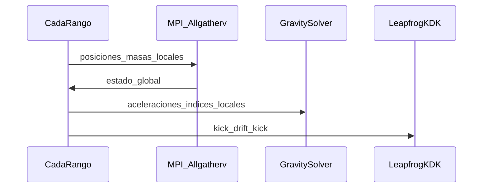

# Arquitectura de **gadget-ng**

Implementación nueva en Rust inspirada **conceptualmente** en GADGET-4 ([sitio oficial](https://wwwmpa.mpa-garching.mpg.de/gadget4/), paper: Springel et al., *Simulating cosmic structure formation with the GADGET-4 code*, MNRAS 506, 2871, 2021; manual PDF enlazado desde el sitio). **No se reutiliza ni copia código** de GADGET.

## Qué se toma de GADGET-4

- **Separación modular** entre estado de partículas, cálculo de fuerzas, integración temporal, I/O de snapshots y capa de comunicación (MPI), análoga a la organización descrita en el paper/manual.
- **N-body colisionless** con **suavizado Plummer** en el denominador de la fuerza pareada \((r^2+\varepsilon^2)^{3/2}\), práctica estándar en códigos cosmológicos.
- **Integración leapfrog** en forma **kick–drift–kick (KDK)** sincronizada con paso global \(\Delta t\) en el MVP (equivalente al núcleo simple del esquema colisionless; sin paso jerárquico local como en GADGET-4 avanzado).
- **Paralelismo MPI** con **descomposición por bloques contiguos de `global_id`** y **reunión global** de posiciones/masas (`MPI_Allgatherv` vía `mpi` crate) antes de evaluar el solver de gravedad en cada subconjunto local — patrón conceptualmente alineado con “acumular estado global para el solver”, simplificado frente a halos de vecinos y frente a un árbol MPI distribuido (fase futura).

## Qué se simplifica

- **Gravedad**: **fuerza directa \(O(N^2)\)** (`DirectGravity` en `gadget-ng-core`) y **Barnes–Hut monopolar** \(O(N\log N)\) sobre octree en arena (`gadget-ng-tree`, `BarnesHutGravity`); sin TreePM/FMM ni PM (fases posteriores). Se elige vía TOML `[gravity].solver`.
- **Dominio**: sin cosmología, SPH, ni I/O binario legacy; snapshots versionados con `provenance.json` y `meta.json` (véase I/O abajo).
- **MPI**: sin híbrido MPI+OpenMP del paper de GADGET-4; un solo hilo por rango en el MVP.
- **Configuración**: TOML + variables de entorno `GADGET_NG_*` (figment), por legibilidad y alineación con el ecosistema Rust.

## Qué se descarta (por ahora)

- Hidrodinámica, cosmología obligatoria en el core, árboles de fusión, y demás componentes de GADGET-4 no necesarios para un **MVP N-body** verificable.
- **GPU**: feature `gpu` reservada en el CLI (sin kernels aún). **HDF5 / bincode**: opcionales en `gadget-ng-io` (ver sección I/O).

## Crates

| Crate | Rol |
|--------|-----|
| `gadget-ng-core` | `Vec3`, `Particle`, `RunConfig`, IC sintéticas, `DirectGravity` / trait `GravitySolver` |
| `gadget-ng-tree` | Octree + `BarnesHutGravity` (MAC `s/d` con `d` al COM; no MAC si la evaluación cae dentro de la celda del nodo) |
| `gadget-ng-integrators` | `leapfrog_kdk_step` (KDK, `FnMut` para aceleraciones) |
| `gadget-ng-parallel` | `ParallelRuntime`: `SerialRuntime`, `MpiRuntime` (`feature = "mpi"`) |
| `gadget-ng-io` | Snapshots (`SnapshotFormat`: JSONL / bincode / HDF5) + `Provenance` |
| `gadget-ng-cli` | Binario `gadget-ng` (`config`, `stepping`, `snapshot`) |

### I/O de snapshots

El TOML `[output] snapshot_format` usa el enum `SnapshotFormat` en [`config.rs`](../crates/gadget-ng-core/src/config.rs) (`jsonl` \| `bincode` \| `hdf5`). Siempre se escriben `meta.json` y `provenance.json` (incluyen `time`, `redshift`, `box_size` para cabeceras HDF5).

| Formato | Feature Cargo | Ficheros extra | Notas |
|--------|----------------|----------------|--------|
| JSONL | (default) | `particles.jsonl` | Una línea JSON por partícula; scripts de paridad actuales lo consumen. |
| bincode | `gadget-ng-io/bincode` | `particles.bin` | `Vec<ParticleRecord>` serializado; sin dependencias C. |
| HDF5 | `gadget-ng-io/hdf5` | `snapshot.hdf5` | Grupos `Header` / `PartType1` al estilo GADGET-4 (`Coordinates`, `Velocities`, `Masses`, `ParticleIDs`); dataset `Provenance/gadget_ng_json_utf8`. Requiere `libhdf5` en el sistema. |

API: `gadget_ng_io::writer_for` + trait `SnapshotWriter`, o `write_snapshot_formatted` (usado por el CLI).

### Barnes–Hut vs FMM (decisión MVP)

Para salir de \(O(N^2)\) sin multiplicar la superficie de código, el MVP usa **monopolo por nodo** (masa total + COM) y el MAC clásico `s/d < \theta` con \(d\) la distancia al COM del nodo. **FMM** u órdenes multipolares superiores quedan reservados para cuando haga falta más precisión por celda con el mismo \(\theta\).

## Flujo de `stepping` (MPI)



### Rendimiento / Paralelismo intra-rango

La sección `[performance]` del TOML controla el paralelismo dentro de cada rango MPI:

```toml
[performance]
deterministic = false   # true (default) = serial; false = Rayon activo
num_threads = 4         # opcional; None → número de CPUs lógicas
```

| `deterministic` | Feature build | Solver activo | Paridad serial/MPI |
|-----------------|---------------|---------------|--------------------|
| `true` (default) | cualquiera | `DirectGravity` / `BarnesHutGravity` (serial) | **garantizada** |
| `false` | `--features simd` | `RayonDirectGravity` / `RayonBarnesHutGravity` | **no garantizada** (reordenación de sumas) |

El paralelismo se aplica al **bucle externo** de partículas (cada partícula es independiente). El tree walk interno de BH permanece serial por partícula (los nodos del árbol son de solo lectura: `Sync` sin cambios en `Octree`).

Los benchmarks viven en `crates/gadget-ng-core/benches/direct_gravity.rs` y `crates/gadget-ng-tree/benches/bh_gravity.rs` (Criterion). Para ejecutarlos:

```bash
cargo bench -p gadget-ng-core --features gadget-ng-core/simd
cargo bench -p gadget-ng-tree --features gadget-ng-tree/simd
```

## Limitaciones del MVP

- Con `solver = "direct"`, el escalado \(O(N^2)\) no está pensado para producción masiva; con **Barnes–Hut** el coste es \(O(N\log N)\) por paso pero sigue sin PM ni dominios cosmológicos grandes. El objetivo sigue siendo **arquitectura limpia**, **MPI real** y **cadena de validación** reproducible.
- La paridad serial/MPI se valida numéricamente con tolerancia explícita en [experiments/nbody/mvp_smoke/docs/validation.md](../experiments/nbody/mvp_smoke/docs/validation.md).
