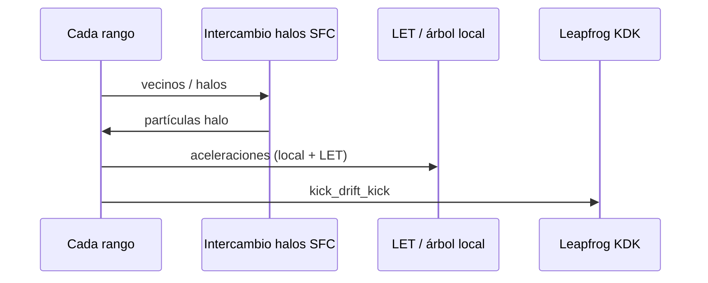

# Arquitectura de **gadget-ng**

Implementación en Rust inspirada **conceptualmente** en GADGET-4 ([sitio oficial](https://wwwmpa.mpa-garching.mpg.de/gadget4/), paper: Springel et al., *Simulating cosmic structure formation with the GADGET-4 code*, MNRAS 506, 2871, 2021; manual PDF enlazado desde el sitio). **No se reutiliza ni copia código** de GADGET.

## Qué se toma de GADGET-4

- **Separación modular** entre estado de partículas, fuerzas, integración temporal, I/O, comunicación MPI y (opcionalmente) hidrodinámica, MHD y radiación — análoga al diseño descrito en el paper/manual.
- **N-body colisionless** con **suavizado Plummer** en \((r^2+\varepsilon^2)^{3/2}\).
- **Integración leapfrog** en forma **kick–drift–kick (KDK)** con paso global o **block timesteps jerárquicos** (Aarseth + predictor, estilo GADGET-4).
- **TreePM** con splitting Gaussiano en *k*-space (PM filtrado + corto alcance en árbol con kernel erfc).
- **Cosmología** opcional (Friedmann, drift/kick en \(a\)), cajas periódicas con **PM / TreePM**, ICs Zel'dovich con Eisenstein–Hu y normalización \(\sigma_8\).

## Capacidades actuales (visión de conjunto)

- **Gravedad**: directa \(O(N^2)\), Barnes–Hut, PM periódico 3D, TreePM; rutas **MPI** con descomposición **SFC (Hilbert 3D)** y **LET** para el corto alcance, alternativa legacy `MPI_Allgatherv` cuando se fuerza explícitamente; PM distribuido con patrones allreduce / slab / lápiz / scatter–gather según configuración y fase.
- **Cosmología**: \(\Omega_m\), \(\Omega_\Lambda\), CPL \(w_0,w_a\), masas de neutrinos (entrada en eV); **ICs** 1LPT/2LPT, transferencias Eisenstein–Hu, convenciones de normalización (`Legacy` / `Z0Sigma8`).
- **Bariones y campos**: crates **SPH**, **MHD**, **RT** integrados en el workspace (gas, estrellas, radiación, etc., según features y TOML).
- **GPU**: **wgpu** (gravedad directa y otros usos portátiles); **CUDA / HIP** para solver PM en GPU (cuando el toolchain está disponible); rutas CPU siempre disponibles.
- **Paralelismo intra-rango**: Rayon, SIMD/AVX2 en directos y BH, opciones `pm-rayon` donde aplique.
- **I/O**: JSONL, bincode, HDF5 estilo GADGET-4, MessagePack, NetCDF; siempre `meta.json` y `provenance.json`.
- **Análisis**: crate `gadget-ng-analysis` e integración CLI (`analyze`, insitu P(k), FoF, etc.).

## MPI y descomposición del dominio

- **Partículas**: descomposición por **órden SFC** (Hilbert 3D) y rangos de `global_id`; intercambio de halos entre vecinos en lugar de reunir todo el estado en cada rank cuando el motor elige el **path SFC+LET** (Barnes–Hut multi-rank sin `force_allgather_fallback`).
- **TreePM / PM cosmológico periódico**: según modo puede activarse **TreePM con path allgather** (estado global para el árbol/PM) o **PM distribuido** (comunicación sobre la malla FFT); el binario registra el path activo en diagnósticos (p. ej. `treepm_serial`, `treepm_allgather`, rutas con PM distribuido).
- **Fallback**: `[performance] force_allgather_fallback = true` restaura el patrón tipo allgather global para depuración o comparación con versiones antiguas.

La sección [Flujo de `stepping` (MPI)](#flujo-de-stepping-mpi) resume el camino principal frente al legacy.

## Qué sigue siendo simplificado frente a GADGET-4 “completo”

- **Paridad de parfile**: la configuración es **TOML** + variables `GADGET_NG_*`, no el formato de parámetros del manual GADGET.
- **Multifísica**: la superficie de opciones es grande pero no pretende cubrir cada variante publicada de GADGET-4 en un único ejecutable sin features.
- **Documentación de límites numéricos**: comparaciones de referencia (p. ej. P(k) vs referencias tipo GADGET-4) son **benchmarks**, no garantía bit-a-bit entre códigos.

## Crates

| Crate | Rol |
|--------|-----|
| `gadget-ng-core` | Tipos base (`Vec3`, `Particle`), `RunConfig`, ICs, traits de gravedad, cosmología y unidades |
| `gadget-ng-tree` | Octree, Barnes–Hut |
| `gadget-ng-pm` | PM periódico 3D (CIC, FFT, Poisson en *k*-space) |
| `gadget-ng-treepm` | `TreePmSolver`: splitting Gaussiano, corto alcance en árbol |
| `gadget-ng-integrators` | KDK global, jerárquico, Yoshida |
| `gadget-ng-parallel` | `ParallelRuntime`, MPI, descomposición SFC/slab, LET |
| `gadget-ng-io` | Lectura/escritura de snapshots (JSONL, bincode, HDF5, msgpack, netcdf) |
| `gadget-ng-gpu` | SoA GPU, puentes a kernels |
| `gadget-ng-cuda` / `gadget-ng-hip` | PM en GPU (NVIDIA / AMD) |
| `gadget-ng-analysis` | P(k), utilidades de análisis |
| `gadget-ng-sph` | Hidrodinámica SPH |
| `gadget-ng-mhd` | MHD y extensiones de plasma |
| `gadget-ng-rt` | Radiación transfer |
| `gadget-ng-vis` | Visualización / render auxiliar |
| `gadget-ng-physics` | Tests de integración física |
| `gadget-ng-cli` | Binario `gadget-ng` (`stepping`, `snapshot`, `analyze`, …) |

### I/O de snapshots

El TOML `[output] snapshot_format` usa el enum `SnapshotFormat` en [`config.rs`](../crates/gadget-ng-core/src/config.rs) (`jsonl` \| `bincode` \| `hdf5` \| `msgpack`). Siempre se escriben `meta.json` y `provenance.json` (incluyen `time`, `redshift`, `box_size` para cabeceras HDF5).

| Formato | Feature Cargo | Ficheros extra | Notas |
|--------|----------------|----------------|--------|
| JSONL | (default) | `particles.jsonl` | Una línea JSON por partícula; scripts de paridad actuales lo consumen. |
| bincode | `gadget-ng-io/bincode` | `particles.bin` | `Vec<ParticleRecord>` serializado; sin dependencias C. |
| HDF5 | `gadget-ng-io/hdf5` | `snapshot.hdf5` | Grupos `Header` / `PartType1` al estilo GADGET-4 (`Coordinates`, `Velocities`, `Masses`, `ParticleIDs`); dataset `Provenance/gadget_ng_json_utf8`. Requiere `libhdf5` en el sistema. |
| msgpack | `gadget-ng-io/msgpack` | `particles.msgpack` | `Vec<ParticleRecord>` en MessagePack (`rmp-serde`); puro Rust, compacto, interoperable con Python/R/Julia (`msgpack.unpackb`). |
| netcdf | `gadget-ng-io/netcdf` | `snapshot.nc` | NetCDF-4 (HDF5 backend). Variables SoA: `x/y/z`, `vx/vy/vz`, `mass`, `id`; atributos globales `time`, `redshift`, `box_size`. Interoperable con `xarray`, `netCDF4`, Julia `NCDatasets`. Requiere `libnetcdf-dev` en el sistema. |

**Escritura:** `gadget_ng_io::writer_for` + trait `SnapshotWriter`, o `write_snapshot_formatted` (usado por el CLI).

**Lectura:** API simétrica a la de escritura: trait `SnapshotReader` en `reader.rs` con `SnapshotData { particles, time, redshift, box_size }`.

| Lector | Struct | Fuente de datos |
|--------|--------|-----------------|
| JSONL | `JsonlReader` | `meta.json` + `particles.jsonl` |
| bincode | `BincodeReader` | `meta.json` + `particles.bin` |
| HDF5 | `Hdf5Reader` | `snapshot.hdf5` (atributos `Header/*` + datasets `PartType1/*`) |

Función de conveniencia: `read_snapshot_formatted(fmt, dir)` análoga a `write_snapshot_formatted`.

### Barnes–Hut vs FMM

Para salir de \(O(N^2)\) sin multiplicar la superficie de código, el núcleo BH usa **monopolo por nodo** (masa total + COM) y el MAC clásico `s/d < \theta` con \(d\) la distancia al COM del nodo. **FMM** u órdenes multipolares superiores quedan como extensión si hace falta más precisión por celda con el mismo \(\theta\).

## Flujo de `stepping` (MPI)

Camino **habitual** multirank con Barnes–Hut: intercambio de halos según SFC y aplicación de nodos **LET** remotos (sin reunir todas las partículas en cada proceso). Con `force_allgather_fallback` o condiciones que desactivan SFC+LET, el motor puede usar un **allgather** del estado posición/masa antes del solver (patrón más cercano al prototipo histórico).



Para **PM / TreePM** cosmológico, el diagrama de comunicación concreto depende del path (PM distribuido vs gather de densidad global); ver logs y `diagnostics.jsonl` para el identificador de path activo.

### Rendimiento / Paralelismo intra-rango

La sección `[performance]` del TOML controla el paralelismo dentro de cada rango MPI:

```toml
[performance]
deterministic = false   # true (default) = serial; false = Rayon activo
num_threads = 4         # opcional; None → número de CPUs lógicas
```

#### Jerarquía de solvers directos

| Solver | Condición | Kernel interno | Paridad serial/MPI |
|--------|-----------|----------------|--------------------|
| `DirectGravity` | `deterministic=true` | AoS escalar | **garantizada** |
| `SimdDirectGravity` | `simd` feature, uso directo | SoA + caché-blocking + AVX2 | determinista (no bit-idéntico a `DirectGravity`) |
| `RayonDirectGravity` | `simd` + `deterministic=false` | Rayon outer + SoA+blocking+AVX2 inner | **no garantizada** |
| `BarnesHutGravity` / `RayonBarnesHutGravity` | igual que directos | tree walk | ídem |

#### Kernel SIMD (`gravity_simd`)

El módulo `gadget_ng_core::gravity_simd` implementa:

- **SoA layout**: extrae `xs`, `ys`, `zs`, `masses` como `Vec<f64>` contiguos antes del bucle de partículas.
- **Caché-blocking** (`BLOCK_J = 64`): divide el bucle `j` en tiles de 64 elementos (~2 KB × 4 arrays × 8 B en L1).
- **Auto-vectorización AVX2+FMA**: la función `inner_blocked_avx2` lleva `#[target_feature(enable = "avx2", enable = "fma")]`; con datos SoA contiguos el compilador emite instrucciones `ymm` de 256 bits (4× f64 por ciclo).
- **Mask sin branch**: la condición `j == skip` se convierte en `0.0|1.0`, evitando saltos que impedirían SIMD.
- **Detección en runtime**: `is_x86_feature_detected!` con fallback escalar en CPUs sin AVX2.

`RayonDirectGravity` usa `accel_soa_blocked` en su bucle interno, combinando paralelismo Rayon en el eje `i` con SIMD+blocking en el eje `j`.

El paralelismo se aplica al **bucle externo** de partículas (cada partícula es independiente). El tree walk interno de BH permanece serial por partícula (los nodos del árbol son de solo lectura: `Sync` sin cambios en `Octree`).

Los benchmarks viven en `crates/gadget-ng-core/benches/direct_gravity.rs` y `crates/gadget-ng-tree/benches/bh_gravity.rs` (Criterion). Para ejecutarlos:

```bash
cargo bench -p gadget-ng-core --features gadget-ng-core/simd
cargo bench -p gadget-ng-tree --features gadget-ng-tree/simd
```

**Rayon en PM / TreePM** (`feature = "pm-rayon"` en el CLI):

| Función | Estrategia Rayon |
|---------|-----------------|
| `cic::assign_rayon` | `par_iter().fold()` con arrays locales por hilo + `reduce()` para sumar |
| `cic::interpolate_rayon` | `par_iter().map()` — lectura independiente del grid por partícula |
| `fft_poisson` (k-space) | `(0..nm³).into_par_iter().map().collect()` — cálculo `Φ̂(k)` y `F̂` independiente por celda |
| `short_range::short_range_accels` (TreePM) | `par_iter_mut().zip().for_each()` — árbol `&Octree` compartido (`Sync`) |

Activar con:
```toml
# Cargo.toml del binario:
features = ["pm-rayon"]
```

### Pasos temporales jerárquicos (block timesteps)

La sección `[timestep]` del TOML activa el esquema de block timesteps al estilo GADGET-4:

```toml
[timestep]
hierarchical = true   # false (default) = paso global uniforme
eta = 0.025           # parámetro Aarseth; dt_i = eta * sqrt(eps / |a_i|)
max_level = 6         # máx. subdivisiones; n_fine = 2^max_level sub-pasos
```

**Criterio de Aarseth** (`aarseth_bin`): el paso individual de cada partícula se
cuantiza a la potencia de 2 inmediatamente menor o igual a `dt_courant = eta * sqrt(eps / |a|)`:

```
nivel k  →  dt_i = dt_base / 2^k   (k ∈ [0, max_level])
```

**Algoritmo KDK con predictor** (`hierarchical_kdk_step`): para cada sub-paso fino `s`:

1. **START kick** para partículas que inician su paso en `t = s·fine_dt` (`s % stride(k) == 0`):
   `elapsed[i] = 0; v += a * (dt_i / 2)`
2. **Drift** de *todas* las partículas (primer orden): `x += v * fine_dt; elapsed[i] += 1`
3. **Predictor + END kick** para partículas que terminan su paso en `t = (s+1)·fine_dt`:
   - Antes de evaluar fuerzas, las posiciones de las partículas **inactivas** se mejoran temporalmente:
     `Δx_j = 0.5 * a_j * (elapsed[j] * fine_dt)²` (predictor de Störmer)
   - Se evalúan fuerzas con las posiciones predichas.
   - Se restauran las posiciones reales (`x_j -= Δx_j`).
   - `v += a_new * (dt_i / 2)`, `elapsed[i] = 0`, se reasigna el bin.

El predictor reduce el error de posición de las inactivas de O(Δt²) a O(Δt³) para la
evaluación de fuerzas, sin alterar la integración simpléctica de las activas.
`HierarchicalState` incluye `elapsed: Vec<u64>` para rastrear el tiempo desde el último kick.

`HierarchicalState` mantiene el vector de niveles fuera de `Particle` para no alterar
`PartialEq` y otros derives del struct de core.

**Snapshot de HierarchicalState:** para permitir reanudar simulaciones jerárquicas, `HierarchicalState` implementa `Serialize/Deserialize` (serde) y expone:

```rust
state.save(dir)           // escribe <dir>/hierarchical_state.json
HierarchicalState::load(dir) // carga desde <dir>/hierarchical_state.json
```

El engine guarda automáticamente el estado junto al snapshot final cuando `[timestep] hierarchical = true`.

### Solver TreePM

El crate `gadget-ng-treepm` implementa `TreePmSolver` que divide el campo gravitacional entre largo y corto alcance mediante un **splitting Gaussiano en k-space**, siguiendo el esquema estándar de los códigos cosmológicos (cf. GADGET-4):

```
F_total(r) = F_lr(r)  +  F_sr(r)

F_lr(r) = G·m/r² · erf(r / (√2·r_s))     ← PM con filtro exp(-k²·r_s²/2)
F_sr(r) = G·m/r² · erfc(r / (√2·r_s))    ← octree + kernel erfc, cutoff r_cut = 5·r_s
```

La partición `erf + erfc = 1` garantiza que `F_lr + F_sr = F_Newton`.

#### Parámetros

| Campo TOML | Descripción | Default |
|-----------|-------------|---------|
| `pm_grid_size` | Celdas por lado del grid PM | 64 |
| `r_split` | Radio de splitting (≤ 0 → auto 2.5 × cell_size) | 0.0 |

```toml
[gravity]
solver       = "tree_pm"
pm_grid_size = 64
r_split      = 0.0
```

#### Largo alcance (`gadget-ng-pm::fft_poisson::solve_forces_filtered`)

Igual que `solve_forces` pero multiplica el potencial en k-space por `exp(-k²·r_s²/2)`.
Esto corresponde a convolucionar la densidad con una Gaussiana de anchura `r_s` en espacio real.

#### Corto alcance (`gadget-ng-treepm::short_range`)

- Construye un octree con `Octree::build` del crate `gadget-ng-tree`.
- Para cada partícula activa, recorre el árbol con un **cutoff** `r_cut = 5·r_s` (fuera de r_cut, erfc < 1e-8 → fuerza nula).
- Para nodos lejanos pero dentro del cutoff: usa el **monopolo** si `half_size < 0.1·r_cut`.
- Para nodos cercanos: baja hasta las hojas (pares exactos).
- `erfc_approx(x)` implementa Abramowitz & Stegun §7.1.26 (error máx. 1.5×10⁻⁷, sin dependencias C).

### Solver Particle-Mesh (PM) periódico 3D

El crate `gadget-ng-pm` implementa `PmSolver` que resuelve la ecuación de Poisson gravitacional usando una malla 3D periódica y FFT pura en Rust (`rustfft`). El costo es **O(N + N_M³ log N_M)** por evaluación de fuerzas.

#### Algoritmo

```
Partículas (x_i, m_i)
  │  CIC assign
  ▼
ρ[NM³]           (masa/celda; NM = pm_grid_size)
  │  FFT 3D (3× pasadas 1D con rustfft)
  ▼
ρ̂(k)
  │  Poisson: Φ̂(k) = -4πG·ρ̂(k) / k²   (k=0 → 0)
  ▼
F̂_α(k) = -i·k_α·Φ̂(k)   (α = x, y, z)
  │  IFFT 3D × 3
  ▼
F_α[NM³]
  │  CIC interpolate
  ▼
a_i  (aceleraciones por partícula)
```

1. **CIC mass assignment** (`cic::assign`): cada partícula distribuye su masa a los 8 nodos vecinos con pesos trilineales. El grid es periódico (`% nm`).
2. **FFT 3D** (`fft_poisson`): tres pasadas de 1D FFTs (eje X → Y → Z) con `FftPlanner` de `rustfft`. Sin dependencias C.
3. **Poisson en k-space**: `Φ̂(k) = -4πG·ρ̂(k) / k²`; el modo DC (k=0) se pone a cero para eliminar la fuerza de fondo uniforme.
4. **Fuerzas** por componente: `F̂_α = -i·k_α·Φ̂`, IFFT 3D.
5. **CIC interpolation** (`cic::interpolate`): aceleración por partícula interpolada del grid con los mismos pesos trilineales.

#### Configuración TOML

```toml
[gravity]
solver = "pm"
pm_grid_size = 64   # grid NM³; potencia de 2 recomendada para eficiencia FFT
```

#### Notas de diseño

- La resolución de fuerza es la escala de celda `box_size / pm_grid_size`; para fuerzas de largo alcance se recomienda `pm_grid_size` ≈ N^(1/3) – 2×N^(1/3).
- El solver es **serial** por defecto en la asignación CIC salvo features Rayon; la paralelización está documentada arriba.
- Las fuerzas son **periódicas** por construcción (incluyen todas las imágenes del sistema).
- No aplica softening explícito (`eps2` se ignora); el suavizado natural es la escala de celda.

## Limitaciones actuales

- **`solver = "direct"`** escala como \(O(N^2)\): solo para pruebas o N modesto.
- **Paridad numérica**: SIMD, Rayon y rutas MPI distintas no garantizan igualdad bit-a-bit entre configuraciones; hay tolerancias en tests y validaciones documentadas (p. ej. [experiments/nbody/mvp_smoke/docs/validation.md](../experiments/nbody/mvp_smoke/docs/validation.md)).
- **Modos cosmológicos complejos**: conviene validar cada combinación (PM distribuido + jerárquico + MPI) frente a referencias antes de producción.

## Evolución histórica (MVP inicial)

Las primeras fases del proyecto priorizaban un **MVP** verificable: integración KDK global, MPI con reunión global de estado (`Allgatherv`) para el solver, sin cosmología extendida ni GPU productiva, y crates de hidrodinámica aún no integrados. Ese relato sirve para entender commits y documentación antigua; el comportamiento **actual** es el descrito en las secciones anteriores.
