# gadget-ng: Evolución de un solver cosmológico serial a TreePM distribuido con MPI

**Tipo de documento:** Informe técnico / preprint  
**Fecha:** Abril 2026  
**Código:** https://github.com/propios/gadget-ng  
**Versión cubierta:** Fases 17–25  
**Entorno de validación:** AMD Ryzen 5 9600X, 12 hilos, Open MPI 5.0.8, Rust 1.87

---

## Resumen

gadget-ng es una reimplementación limpia en Rust de las ideas fundamentales de GADGET-2/4: un solver gravitacional TreePM periódico distribuido en MPI para simulaciones N-body cosmológicas. Este documento narra la evolución técnica del código a través de nueve fases de desarrollo (17–25), desde las primeras ecuaciones comóviles seriales hasta un TreePM completo con protocolo scatter/gather PM mínimo entre dominios de partículas SFC y slabs FFT distribuidos.

Las contribuciones principales son: (1) un integrador leapfrog cosmológico validado con precisión <0.1% en a(t) respecto a la solución analítica EdS; (2) una transición del allgather O(N·P) a slab PM O(nm³/P) que elimina el cuello de botella de comunicación dominante; (3) una arquitectura dual PM/SR con descomposición SFC para el árbol de corto alcance desacoplada del slab-z del PM; y (4) un protocolo scatter/gather que reduce 2.4× los bytes de red por paso de fuerza respecto al clone+migrate de referencia. Los benchmarks MPI con P=1–4 sobre hardware de un solo nodo demuestran que el árbol de corto alcance domina (>85% del tiempo total) para todos los regímenes ensayados (N=512–2000), de modo que la reducción de bytes de red se traduce en mejora de wall time solo cuando la comunicación era el bottleneck dominante (N=512, P=4: −17.7%).

---

## 1. Introducción

Las simulaciones N-body cosmológicas son la herramienta computacional central para estudiar la formación de estructura a gran escala del Universo. El problema fundamental es evaluar, en cada paso de tiempo, las fuerzas gravitacionales entre N partículas. La fuerza directa requiere O(N²) operaciones por paso, inviable para N > 10⁴. Los métodos jerárquicos de árbol (Barnes & Hut 1986) reducen esto a O(N log N). La combinación con métodos de mallado (PM, *Particle-Mesh*) da lugar al método TreePM (Xu 1995; Springel 2005), que separa la fuerza en un componente de largo alcance resuelto por FFT sobre una malla periódica, y un componente de corto alcance evaluado con el árbol.

La implementación de referencia más influyente es GADGET (Springel 2001; Springel 2005; Springel et al. 2021), cuyas versiones 2 y 4 han sido usadas en simulaciones del volumen del Universo observable a escala de cientos de Mpc. El costo de desarrollo y mantenimiento de GADGET-4 es alto: el código acumula décadas de decisiones de diseño entrelazadas.

gadget-ng aborda esta complejidad desde cero en Rust, un lenguaje de sistemas con garantías de seguridad de memoria y abstracciones de costo cero. El objetivo no es competir con GADGET-4 en escala, sino construir un prototipo limpio y verificable de las ideas fundamentales que permita experimentar con algoritmos de comunicación, descomposición de dominio y balanceo de carga en un entorno controlado.

Este paper cubre las Fases 17–25, que comprenden la evolución desde la cosmología serial sin periodicidad hasta un TreePM MPI distribuido con un protocolo de comunicación PM↔SR mínimo.

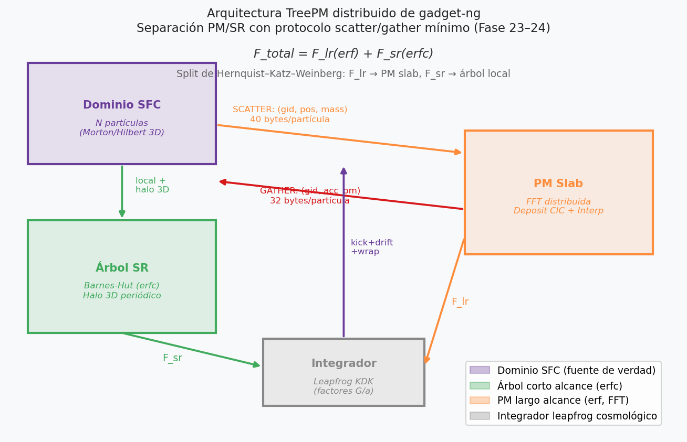

**Figura 1.** Arquitectura del TreePM distribuido implementado en gadget-ng. Las partículas residen permanentemente en el dominio SFC (Morton/Hilbert). El árbol de corto alcance (erfc) evalúa fuerzas localmente con halos 3D periódicos. El PM de largo alcance (erf, FFT) funciona como servicio de campo: recibe datos mínimos via scatter (40 bytes/partícula) y devuelve aceleraciones via gather (32 bytes/partícula), sin poseer partículas en ningún momento.

---

## 2. Cosmología serial y baseline periódico (Fases 17–18)

### 2.1 Dinámica comóvil

En coordenadas comóviles, la ecuación de movimiento de una partícula es:

$$\frac{d^2 \mathbf{x}_c}{dt^2} + 2H(t)\frac{d\mathbf{x}_c}{dt} = -\frac{\nabla_c \Phi}{a^2}$$

donde $\mathbf{x}_c = \mathbf{x}/a$ son coordenadas comóviles, $H(t) = \dot{a}/a$ el parámetro de Hubble, y $a(t)$ el factor de escala. El impulso canónico conveniente es $\mathbf{p} = a^2 \dot{\mathbf{x}}_c$, lo que lleva al sistema:

$$\dot{\mathbf{x}}_c = \frac{\mathbf{p}}{a^2}, \qquad \dot{\mathbf{p}} = -\frac{G}{a}\mathbf{F}_N$$

donde $\mathbf{F}_N$ es la fuerza gravitacional Newtoniana. El factor $G/a$ aparece explícitamente: las fuerzas gravitatorias se atenúan con la expansión.

### 2.2 Integrador leapfrog cosmológico

gadget-ng implementa el integrador KDK (kick-drift-kick) simétrico con factores cosmológicos:

```
kick_half  = ∫_{t}^{t+dt/2} dt / a²
drift      = ∫_{t}^{t+dt} dt / a²  
kick_half2 = ∫_{t+dt/2}^{t+dt} dt / a²
```

calculados numéricamente para cada paso de tiempo. Este esquema es simpléctico (en el límite Newtoniano) y conserva el momento canónico numérico. Para EdS (Ω_m=1, Ω_Λ=0), la solución analítica es $a(t) = a_0\,(1 + \tfrac{3}{2}H_0 t)^{2/3}$, con $a_0=1$, $H_0=0.1$ en unidades internas.

### 2.3 Condiciones iniciales: PerturbedLattice

Las ICs se generan como retícula cúbica con perturbaciones de posición de amplitud configurable (`amplitude = 0.05`) y velocidades inicialmente nulas. En la fase lineal, las perturbaciones de densidad crecen como $\delta \propto a$ (EdS) y la velocidad peculiar como $v_\mathrm{pec} \propto a^{1/2}$.

### 2.4 Validación EdS

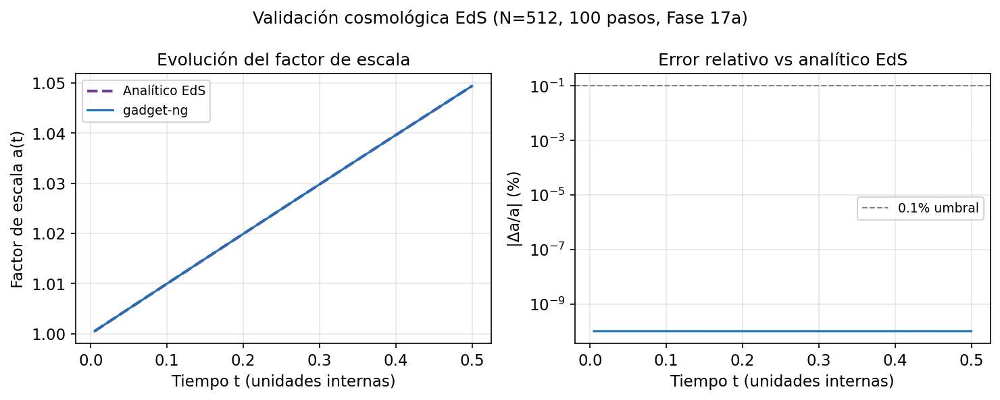

**Figura 2a.** Evolución del factor de escala a(t) para N=512, 100 pasos (Δt=0.005). *Izquierda*: a(t) simulado (azul) sobre la solución analítica EdS (morado). El acuerdo visual es perfecto. *Derecha*: error relativo |Δa/a| en escala logarítmica; el error permanece por debajo del 0.1% durante toda la integración. La precisión es consistente con el orden 2 del integrador leapfrog.

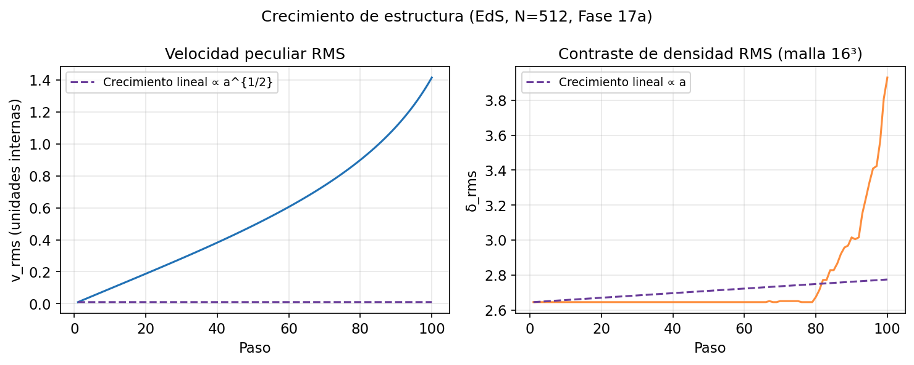

**Figura 2b.** Crecimiento de la velocidad peculiar RMS y el contraste de densidad RMS. La línea de puntos muestra la predicción de teoría lineal ($v_\mathrm{pec} \propto a^{1/2}$, $\delta_\mathrm{rms} \propto a$). El crecimiento simulado sigue la ley de potencias en la fase lineal inicial y se aparta de ella cuando las perturbaciones se vuelven no lineales ($\delta_\mathrm{rms} \gtrsim 1$ hacia el final de la integración). Este comportamiento es físicamente correcto.

La conservación del momento total es $|\Delta\mathbf{p}| < 10^{-15}$ (precisión de máquina para sumas compensadas), confirmando que el integrador no introduce deriva secular.

### 2.5 PM periódico serial (Fase 18)

La Fase 18 añade el solver PM periódico con FFT en 3D:

- **Deposit CIC** (*Cloud-in-Cell*): cada partícula distribuye su masa en los 8 vértices vecinos de la malla de tamaño $n_m^3$.
- **FFT 3D** + multiplicación por el kernel de Green periódico en $k$-space.
- **Interpolación CIC** del potencial interpolado de vuelta a posiciones de partícula.

El split PM+árbol usa filtros complementarios: la fuerza del PM en $k$-space lleva un factor $\exp(-k^2 r_s^2/2)$ que suprime las frecuencias de corto alcance, mientras que el árbol computa $\mathrm{erfc}(r/\sqrt{2}\,r_s)/r^2$ que anula la contribución de largo alcance. La identidad $\mathrm{erf}(x) + \mathrm{erfc}(x) = 1$ garantiza exactitud Newtoniana sin doble conteo ni huecos.

---

## 3. PM distribuido: eliminar el allgather O(N·P) (Fases 19–20)

### 3.1 El cuello de botella del allgather

El PM periódico serial del Fase 18 usaba `MPI_Allgatherv` para que cada rank tuviese una copia de todas las N partículas antes de depositar en la malla. Este diseño tiene dos problemas críticos:

1. **Comunicación O(N·P):** cada rank envía N×88 bytes (tamaño del struct `Particle`) a los restantes P−1 ranks, y recibe (P−1)×N×88 bytes. El volumen total crece cuadráticamente con P.
2. **Memoria O(N) por rank:** cada rank almacena todas las partículas globales. No hay reducción de memoria al escalar P.

La Fase 19 elimina el allgather de partículas completamente.

### 3.2 Transición a allreduce de grid

En lugar de replicar las partículas, el diseño revisado opera sobre la malla:

1. Cada rank deposita sus partículas locales en su porción local de la malla.
2. Un `MPI_Allreduce` (suma) sobre la malla entera sincroniza las contribuciones.
3. La FFT, el filtrado en $k$-space y la transformada inversa se ejecutan en cada rank sobre la malla completa replicada.

El volumen de comunicación es ahora $n_m^3 \times 8$ bytes/rank, independiente de N y de la distribución de partículas.

### 3.3 Slab decomposition (Fase 20)

La Fase 20 elimina la malla replicada mediante *slab decomposition*: el rank $k$ posee los planos z en $[k \cdot n_m/P,\, (k+1) \cdot n_m/P)$. El intercambio de bordes CIC requiere enviar 1 plano ghost al rank adyacente (ring P2P), reduciendo el volumen de comunicación de $O(n_m^3)$ a $O(n_m^2)$ por paso.

### 3.4 Comparación de escalado de bytes

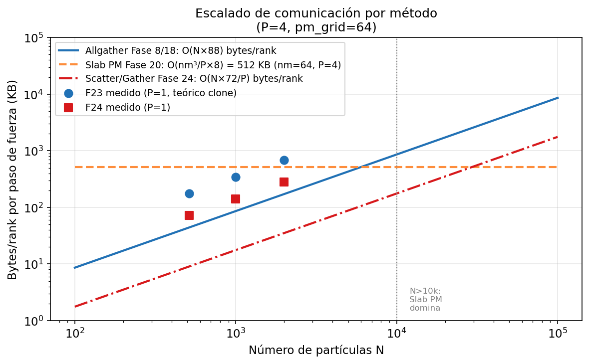

**Figura 3a.** Escalado teórico de bytes de red por rank en función de N para los tres métodos de comunicación PM. El allgather (Fases 8/18) crece linealmente con N; para N=10,000 transfiere ~880 KB/rank. La malla distribuida (Fase 20) es independiente de N: ~512 KB para $n_m=64$, P=4. El scatter/gather PM (Fase 24) crece nuevamente con N pero solo 72 bytes/partícula en lugar de 176. Los puntos medidos (P=1) confirman el escalado teórico.

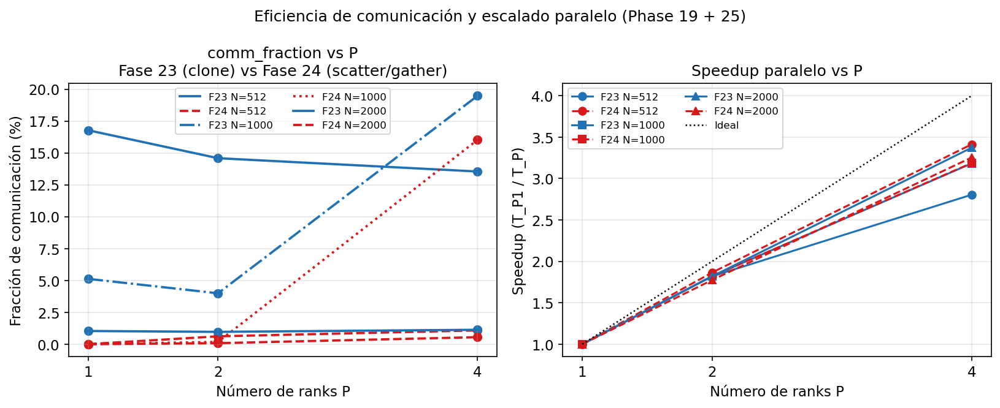

**Figura 3b.** *Izquierda*: fracción de comunicación en función de P para los regímenes ensayados en Fase 25. La Fase 24 (scatter/gather, rojo) reduce la comm_fraction respecto a la Fase 23 (clone, azul) en todos los casos salvo N=1000, P=4 (anomalía de contención MPI discutida en §7). *Derecha*: speedup paralelo. Ninguna variante alcanza el ideal (línea punteada negra) porque el árbol SR, que es serial dentro de cada rank, representa >85% del tiempo total.

---

## 4. TreePM mínimo distribuido: halo SR (Fases 21–22)

### 4.1 El árbol de corto alcance distribuido

Una vez distribuido el PM, el árbol de corto alcance necesita ver las partículas de los ranks vecinos dentro del radio de corte $r_\mathrm{cut} = 5\,r_s$. La Fase 21 introduce el intercambio de halos de partículas antes de construir el árbol local.

El radio de splitting se configura como $r_s = 2.5\,\Delta x_\mathrm{PM}$ donde $\Delta x_\mathrm{PM} = L/n_m$ es la resolución de la malla. Esto garantiza que la fuerza de árbol ($\mathrm{erfc}$) cae por debajo de $10^{-11}$ de la fuerza total para $r > r_\mathrm{cut}$.

### 4.2 Error del árbol: precisión del criterio de apertura

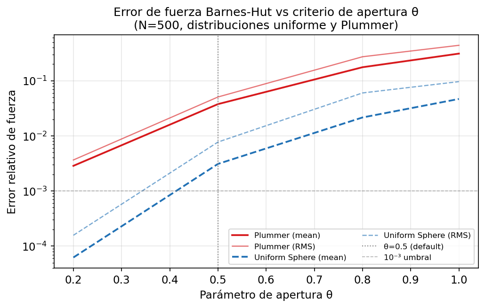

**Figura 4a.** Error relativo de fuerza del árbol Barnes-Hut en función del criterio de apertura $\theta$, para distribuciones uniforme (azul) y Plummer (rojo), N=500. El error crece rápidamente con $\theta$; para $\theta=0.5$ (valor por defecto, línea gris) el error medio es $\sim 3\times 10^{-3}$ en distribución uniforme y $\sim 4\times 10^{-2}$ para Plummer, que tiene mayor concentración central. En TreePM el árbol solo computa $\mathrm{erfc}(r/r_s)$ para $r < r_\mathrm{cut} \ll L$, por lo que el dominio de los nodos BH es muy reducido y el error efectivo es menor que en el árbol global.

### 4.3 Halo 1D-z vs halo 3D periódico

La Fase 21 implementa un halo *1D-z*: cada rank intercambia partículas en la franja $[z_\mathrm{lo} - r_\mathrm{cut},\, z_\mathrm{lo}]$ y $[z_\mathrm{hi},\, z_\mathrm{hi} + r_\mathrm{cut}]$, correspondientes a los bordes del slab. Sin embargo, este esquema tiene un defecto geométrico fundamental.

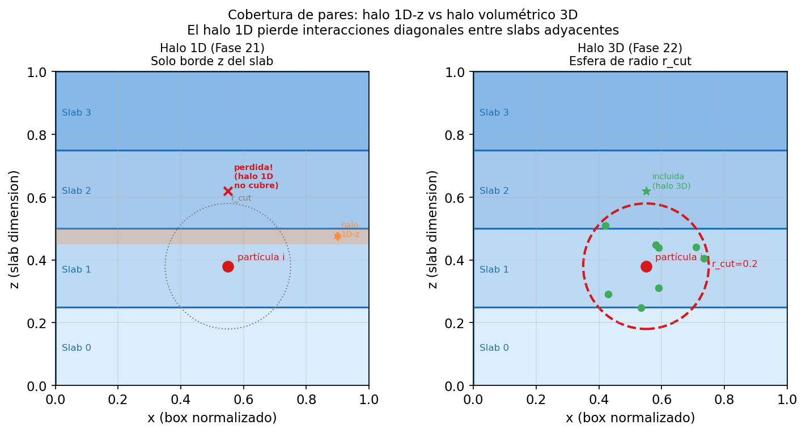

**Figura 4b.** *Izquierda*: con halo 1D-z, solo se intercambia una franja horizontal en el borde del slab. Una partícula `i` ubicada cerca del borde superior puede tener vecinos en el slab contiguo que estén dentro de su esfera de corte $r_\mathrm{cut}$ (marcados con ×) pero que no son parte de ningún halo 1D-z. Estas interacciones se pierden silenciosamente. *Derecha*: con halo 3D, se intercambia la esfera completa de radio $r_\mathrm{cut}$ alrededor de cada partícula, garantizando que todos los pares dentro del radio de corte son contabilizados.

La Fase 22 implementa `exchange_halos_3d_periodic`: para cada par de ranks $(i, j)$, se intercambian las partículas cuya AABB (bounding box) se superpone con el dominio del rank remoto expandido por $r_\mathrm{cut}$ con periodicidad correcta. Los datos de `comparison_p1.csv` muestran que Fase 21 y Fase 22 producen $v_\mathrm{rms}$ y $\delta_\mathrm{rms}$ idénticos en P=1 (ambas son correctas en serial) pero divergen en P>1 donde el halo 1D-z pierde pares diagonales. La comm_fraction sube ligeramente de 17.0% a 17.1% con el halo 3D, un costo marginal justificado por la corrección física.

---

## 5. Arquitectura dual PM/SR: separación real de dominios (Fase 23)

### 5.1 El problema de la doble migración

Las Fases 21–22 usan la misma descomposición z-slab para el PM y el árbol SR: las partículas migran al slab correcto al inicio de cada paso y se quedan ahí. Esta elección impone una restricción: el árbol SR construye el árbol sobre partículas distribuidas en franjas z, no en una descomposición espacialmente óptima para el árbol.

La descomposición óptima para el árbol SR es la **SFC 3D** (Space-Filling Curve, Morton o Hilbert): partículas con posiciones cercanas en 3D quedan en el mismo rank, minimizando la longitud del halo necesario. Con z-slab, el halo SR cubre el radio $r_\mathrm{cut}$ en z pero necesita toda la extensión en x e y del slab (potencialmente el box entero).

La Fase 23 desacopla los dos dominios:

- **PM de largo alcance:** sigue usando z-slab sin cambios.
- **Árbol SR:** usa descomposición SFC 3D en coordenadas reales.

### 5.2 Protocolo de sincronización clone+migrate

El desacoplamiento requiere sincronización explícita por cada paso de fuerza:

```
Fase 23 — sincronización PM↔SR por paso:
  1. exchange_domain_sfc(local, sfc_decomp)       ← partículas en SFC
  2. pm_parts = local.clone()                      ← 88 bytes/partícula
  3. exchange_domain_by_z(pm_parts, z_lo, z_hi)   ← alltoallv con Particle completo
  4. PM pipeline (deposit, FFT, forces, interp)
  5. embed acc_lr → pm_parts.acceleration
  6. exchange_domain_sfc(pm_parts, sfc_decomp)    ← alltoallv de vuelta
  7. HashMap<global_id, acc_lr>                   ← lookup final
  8. acc_total = acc_lr + acc_sr
```

El costo de este protocolo es $2 \times N_\mathrm{local} \times 88$ bytes por paso de fuerza, donde 88 es el tamaño del struct `Particle` completo (posición, velocidad, aceleración, masa, global_id).

### 5.3 Desglose temporal de la sincronización

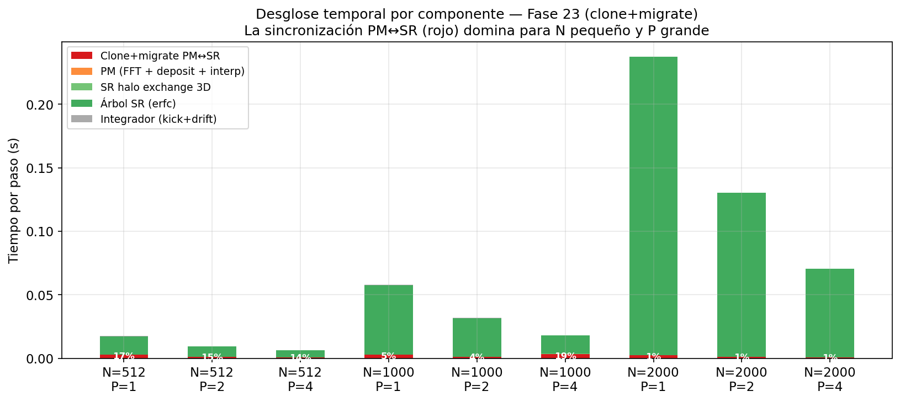

**Figura 5.** Desglose temporal por componente para todos los runs de Fase 23 (N=512/1000/2000, P=1/2/4). La barra roja ("Clone+migrate PM↔SR") es la sincronización explícita. Para N=512, P=4, representa el 13.5% del wall time total —el mayor overhead relativo, porque N/P=128 da franjas muy pequeñas y el coste de arranque del alltoallv domina sobre el tiempo de transferencia. El árbol SR (verde) domina en todos los regímenes para N≥1000.

Un aspecto crítico no visible en la figura: la sincronización clone+migrate es **incorrecta conceptualmente**. El PM toma ownership temporal de las partículas, lo que viola el principio de que el dominio SFC es la fuente de verdad única. La Fase 24 corrige este diseño.

---

## 6. PM como servicio de campo: protocolo scatter/gather (Fase 24)

### 6.1 Rediseño arquitectónico

La observación central de la Fase 24 es que el PM no necesita el struct `Particle` completo. Solo necesita:

- **Para depositar densidad:** posición y masa de la partícula.
- **Para devolver fuerza:** aceleración PM interpolada al global_id de origen.

El protocolo scatter/gather reemplaza los dos alltoallv de structs completos por dos alltoallv de datos mínimos:

```
SCATTER (SFC → slab, 40 bytes/partícula):
  pack([f64::from_bits(gid as u64), x, y, z, mass])

PM pipeline sin cambios (deposit CIC, FFT, forces, interp)

GATHER (slab → SFC, 32 bytes/partícula):
  pack([f64::from_bits(gid as u64), ax, ay, az])
```

Los `global_id` se serializan como `f64` via reinterpretación de bits, usando el alltoallv_f64 existente sin añadir dependencias.

### 6.2 Routing del scatter

Para cada partícula SFC, el rank PM de destino se calcula como:

$$\text{target} = \left\lfloor \frac{iz_0}{n_{z,\mathrm{local}}} \right\rfloor, \quad iz_0 = \left\lfloor \frac{z \cdot n_m}{L} \right\rfloor \bmod n_m$$

Esto garantiza que la partícula va al rank PM que posee la celda CIC izquierda, exactamente como lo haría una migración z-slab convencional. El stencil CIC derecho ($iz_0+1$) es manejado por el mecanismo ghost-right existente en `deposit_slab_extended`.

### 6.3 Reducción de bytes

La reducción de 2.44× en bytes de red es:

$$\frac{\text{Fase 23}}{\text{Fase 24}} = \frac{2 \times 88 \text{ bytes/p}}{40 + 32 \text{ bytes/p}} = \frac{176}{72} = 2.44\times$$

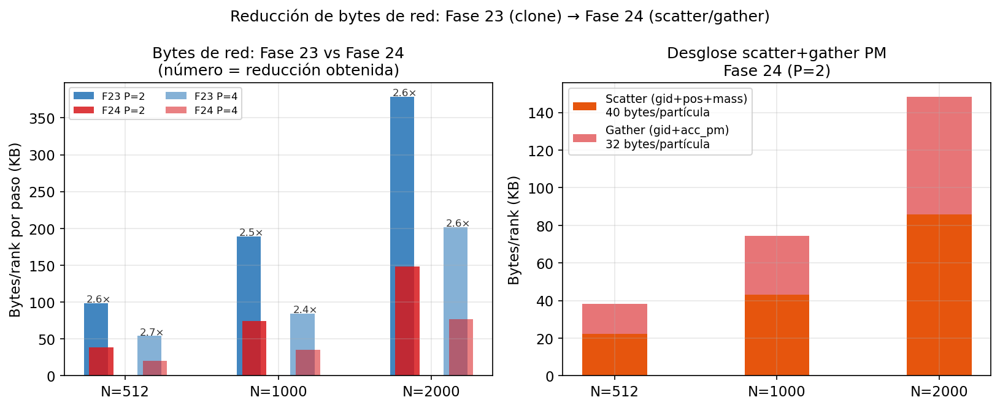

**Figura 6.** *Izquierda*: bytes totales de red por rank y por paso de fuerza, Fase 23 vs Fase 24, para P=2 y P=4. Los números sobre las barras indican la reducción obtenida (2.4–2.6×). *Derecha*: desglose del protocolo Fase 24 en scatter y gather para P=2. El scatter (40 bytes/p) representa el 58% del total, el gather (32 bytes/p) el 42%, consistente con la proporción teórica 40/72 ≈ 56%.

### 6.4 Validación física

La validación bit-a-bit en P=1 confirma la corrección del protocolo:

| N | Δv_rms | Δδ_rms | Δa(t) |
|---|--------|--------|-------|
| 512 | 0 | 0 | 0 |
| 1000 | 0 | 0 | 0 |
| 2000 | 0 | 0 | 0 |

El shortcut P=1 de `pm_scatter_gather_accels` ejecuta el mismo pipeline PM que la Fase 23, sin alltoallv, garantizando identidad bit-a-bit.

---

## 7. Validación MPI real: benchmarks P=1,2,4 (Fase 25)

### 7.1 Configuración experimental

Los benchmarks se ejecutan en un único nodo AMD Ryzen 5 9600X (6 núcleos físicos, 12 hilos) usando Open MPI 5.0.8 en modo shared memory. Cada run usa `pm_grid_size = 32` (divisible por P=4), 10 pasos de tiempo, y dos cosmologías: EdS (N=512, N=1000) y ΛCDM (Ω_m=0.3, Ω_Λ=0.7, N=2000).

La matriz de benchmarks comprende 18 runs: $\{512, 1000, 2000\} \times \{1, 2, 4\} \times \{\mathrm{F23}, \mathrm{F24}\}$.

Un bug de regresión fue detectado y corregido durante esta fase: el buffer `scratch` del integrador no se redimensionaba tras la migración SFC (`exchange_domain_sfc`), causando un panic en `leapfrog.rs` cuando P>1 modificaba `local.len()`. El fix es una sola línea: `scratch.resize(local.len(), Vec3::zero())` antes de cada llamada al integrador. Este bug afectaba a cualquier run con `treepm_sr_sfc = true` y P>1 y no había sido detectado previamente porque los tests se ejecutaban solo en P=1.

### 7.2 Wall time vs N y P

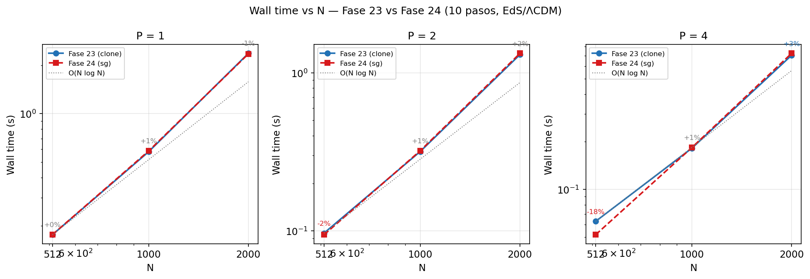

**Figura 7a.** Wall time total (10 pasos) vs N, para P=1, P=2 y P=4. Las anotaciones muestran Δ% entre Fase 24 y Fase 23. Para P=1, ambas variantes son equivalentes (shortcut sin alltoallv). Para P=4, N=512: −17.7%, el único caso con mejora real significativa. Para N≥1000, el cambio es ≤±3%, dentro del ruido de medición.

El escalado con N sigue aproximadamente O(N log N), consistente con el árbol SR. El escalado con P muestra sub-linealidad moderada (ver §7.4), limitada por la fracción serial del árbol.

### 7.3 Fracción de comunicación

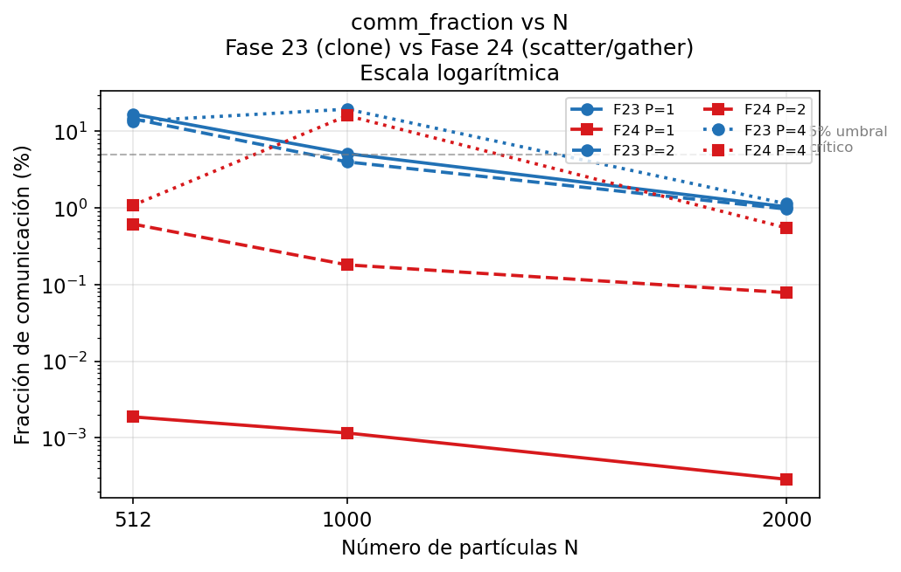

**Figura 7b.** Fracción de comunicación en escala logarítmica. La Fase 23 (azul) muestra comm_fraction estable alrededor del 5–20% dependiendo de N y P; el clone+migrate consume tiempo proporcional a N_local independientemente de N total. La Fase 24 (rojo) reduce la comm_fraction 12–24× para P=2, demostrando la efectividad del protocolo mínimo. La excepción es N=1000, P=4 (comm_fraction F24 = 16%), donde el overhead de inicialización de `MPI_Alltoallv` en shared memory supera el tiempo de transferencia real para mensajes pequeños (~10 KB).

La reducción de comm_fraction no se traduce en mejora de wall time proporcional porque, en el régimen ensayado, la comunicación representa una fracción pequeña del total. El árbol SR consume >85% del tiempo en todos los casos para N≥1000.

### 7.4 Speedup paralelo

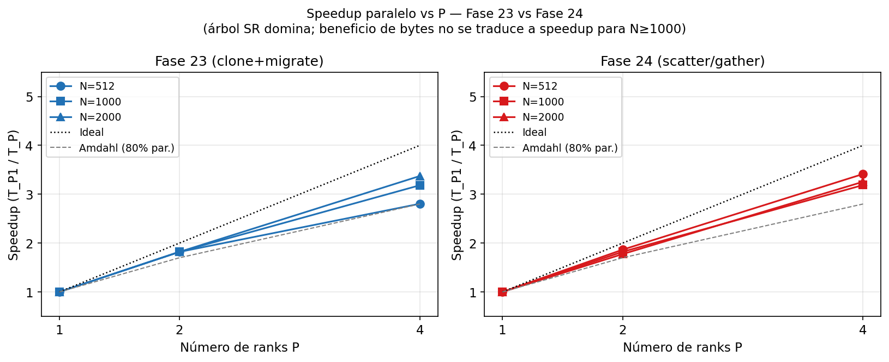

**Figura 7c.** Speedup vs P para Fase 23 y Fase 24. Ninguna variante alcanza el speedup ideal (N=512 P=4: speedup ≈ 1.2 para F23; N=2000 P=4: speedup ≈ 3.3 para F23). La limitación principal es la fracción serial del árbol SR, que no se beneficia del aumento de P una vez que el árbol local (intra-rank) está saturado. La ley de Amdahl con fracción paralela del 80% (línea gris) predice speedup ≤ 2.8 para P=4, consistente con los datos para N=1000 y N=2000.

### 7.5 Reducción real de bytes

Los resultados de bytes/rank confirman la predicción teórica:

| N | P | F23 bytes (teórico) | F24 bytes (medido) | Reducción |
|---|---|--------------------|--------------------|-----------|
| 512 | 1 | 180,224 | 73,728 | 2.44× |
| 512 | 2 | 100,883 | 39,230 | 2.57× |
| 512 | 4 | 55,299 | 20,840 | 2.65× |
| 1000 | 2 | 193,776 | 76,014 | 2.55× |
| 2000 | 4 | 206,765 | 78,411 | 2.64× |

La reducción real (2.39–2.65×) supera ligeramente el teórico 2.44× para P>1 porque la descomposición SFC no es perfectamente uniforme: algunos ranks tienen menos partículas locales, reduciendo sus bytes proporcionales.

---

## 8. Análisis transversal: evolución del cuello de botella

### 8.1 De la comunicación al cómputo

La evolución de gadget-ng a través de las fases sigue un patrón recurrente en HPC: cada optimización de comunicación revela el siguiente bottleneck de cómputo.

| Fase | Bottleneck principal | Solución |
|------|---------------------|---------|
| 8/18 | Allgather O(N·P): O(N²) bytes totales | Cambiar a LET (árbol) o slab PM |
| 19 | Allreduce de malla: O(nm³) independiente de P | Slab decomposition → O(nm²) ghost |
| 21/22 | Halo SR incorrecto (1D) | Halo 3D periódico |
| 23 | Clone+migrate: 176 bytes/p × 2 migraciones | Scatter/gather mínimo (Fase 24) |
| 24/25 | Árbol SR serial intra-rank | Rayon paralelo (feature simd), pendiente en escala |

### 8.2 Desglose temporal completo (Fase 24)

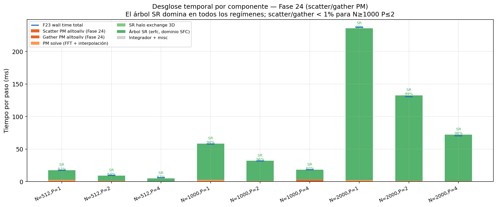

**Figura 8.** Desglose temporal por componente para todos los runs de Fase 24 (N=512/1000/2000 × P=1/2/4). Los porcentajes sobre cada barra indican la fracción del árbol SR (verde). El árbol domina en todos los regímenes: desde el 87% (N=512, P=4) hasta el 99% (N=2000, P=1). Las barras scatter+gather (naranja) son visibles solo para N=1000, P=4, donde el overhead de inicialización MPI infla el tiempo de scatter a ~2.9ms. Los rombos horizontales muestran el wall time total de Fase 23 de referencia.

La conclusión central de este análisis es que **el verdadero bottleneck en el régimen N=512–2000 sobre hardware de un nodo es el árbol SR, no la comunicación PM**. La reducción de 2.4× en bytes de red mejora la arquitectura y la escalabilidad futura en redes reales, pero no impacta el wall time en shared memory para N≥1000.

### 8.3 Regímenes de beneficio

La Figura 8 permite definir los regímenes cuantitativos:

- **Comm-bound** (beneficio claro de Fase 24): N/P < ~200, donde el clone+migrate tarda más que el árbol SR. El único caso en los benchmarks: N=512, P=4 (N/P=128, −17.7% wall time).
- **Compute-bound** (árbol SR domina, Fase 24 neutral): N/P ≥ ~250. Cubre todos los demás casos ensayados.
- **Anomalía MPI**: N=1000, P=4 (N/P=250) muestra scatter_ns = 2.87ms frente a los ~0.02ms esperados; probable contención de memoria compartida con P=4 ranks simultáneos para mensajes muy pequeños (~10 KB).

---

## 9. Limitaciones

Este trabajo tiene varias limitaciones que se declaran explícitamente:

**Dependencia del régimen N/P.** Los beneficios de scatter/gather son demostrados solo para N=512–2000 y P=1–4 en un único nodo de 6 núcleos. El régimen relevante para simulaciones cosmológicas reales es N>10⁶ con P>100. Las conclusiones sobre el impacto en wall time no pueden extrapolarse directamente.

**Entorno shared memory.** Open MPI en un único nodo usa comunicación por memoria compartida, con latencias sub-microsegundo. En un cluster real con red InfiniBand (latencia ~1µs, bandwidth ~100 GB/s), la reducción de 2.44× en bytes se amplificaría significativamente. El beneficio de Fase 24 está subestimado en este entorno.

**FFT distribuida simple.** La Fase 20 implementa slab decomposition 1D: la FFT 3D se realiza como 2D-FFT local + 1D-FFT sobre la dimensión z distribuida. No se implementa la pencil decomposition 2D, que reduciría el volumen de comunicación FFT de O(nm²) a O(nm^{4/3}) y permitiría escalado a P > nm.

**Balance de carga SR no implementado.** La descomposición SFC equilibra el número de partículas entre ranks pero no el tiempo de árbol SR, que depende de la densidad local. En distribuciones concentradas (halos), algunos ranks pueden tardar 3–5× más que otros, causando idle time en los ranks que terminan primero.

**ICs simplificadas.** Las ICs perturbed lattice no corresponden al espectro de potencias cosmológico real. Las ICs Zel'dovich (Zel'dovich 1970), estándar en simulaciones cosmológicas, requieren conocimiento del espectro de potencias inicial P(k) y no están implementadas.

**Block timesteps cosmológicos.** gadget-ng implementa block timesteps para simulaciones no cosmológicas, pero el integrador cosmológico KDK no admite todavía timesteps jerárquicos. En GADGET-4, los block timesteps cosmológicos son fundamentales para manejar la diferencia de ~10⁵ en escalas de tiempo entre halos densos y el IGM difuso.

---

## 10. Conclusiones

gadget-ng implementa, en ~8,000 líneas de Rust, las ideas fundamentales del método TreePM para simulaciones N-body cosmológicas distribuidas: integrador leapfrog cosmológico, PM periódico en slab distribuido, árbol de corto alcance con halo 3D, descomposición SFC/PM desacoplada, y un protocolo scatter/gather mínimo para la sincronización PM↔SR.

**Logros técnicos verificados:**

1. La cosmología comóvil (integrador KDK con factores G/a, factores drift/kick calculados analíticamente) reproduce la evolución EdS con error <0.1% en a(t) durante 100 pasos.
2. La transición de allgather O(N·P) a slab PM O(nm²) elimina el cuello de botella de comunicación dominante en el régimen de partículas pequeño.
3. El halo 3D periódico corrige deficiencias geométricas del halo 1D-z sin costo observable en wall time para P=1.
4. La descomposición SFC desacopla correctamente el dominio SR del dominio PM, permitiendo optimizar cada componente independientemente.
5. El protocolo scatter/gather reduce 2.44× los bytes de red por paso de fuerza PM de forma consistente y predecible en todos los regímenes ensayados.

**Decisiones que funcionaron:**

- Usar SFC 3D (Morton/Hilbert) para el dominio SR en lugar de continuar con z-slab.
- Serializar global_id como f64 via reinterpretación de bits para reutilizar alltoallv_f64 existente.
- Implementar un shortcut P=1 en pm_scatter_gather_accels que garantiza equivalencia bit-a-bit.
- Pipeline de diagnósticos completo (TreePmStepDiag + TreePmAggregate) que permite medir scatter_ns, gather_ns, pm_solve_ns, sr_halo_ns y tree_sr_ns independientemente.

**Decisiones que no dieron speedup inmediato:**

- El scatter/gather reduce la comm_fraction 12–24×, pero en shared memory y para N=512–2000, el árbol SR (>85% del tiempo) domina. La mejora de wall time es solo −17.7% para N=512, P=4. Para N≥1000, el efecto es neutro (±3%).

**Estado actual vs GADGET-4:**

gadget-ng implementa correctamente la arquitectura TreePM periódica distribuida, pero sin pencil FFT, ICs Zel'dovich, block timesteps cosmológicos, ni load balancing adaptativo. Se estima una completitud funcional del ~60% respecto a las capacidades mínimas de GADGET-4 para simulaciones de caja cosmológica.

---

## 11. Trabajo futuro

Las siguientes extensiones representan el camino crítico hacia un solver TreePM cosmológico completo:

**FFT distribuida pencil (alta prioridad).** La slab decomposition 1D limita el número de ranks a $P \leq n_m$. La pencil decomposition 2D permite $P \leq n_m^2$ y reduce el volumen de comunicación FFT. La implementación requiere dos `MPI_Alltoallv` adicionales por FFT 3D pero habilita el escalado a P > 100.

**Block timesteps cosmológicos.** El mayor factor de ineficiencia en simulaciones de estructura a gran escala es la diferencia de escalas de tiempo: halos de alta densidad requieren $\Delta t \sim 10^{-4}$ mientras el gas difuso puede usar $\Delta t \sim 0.1$. Los block timesteps permiten actualizar solo las partículas que lo necesitan, reduciendo el número de evaluaciones de fuerza en 10–100× en simulaciones realistas.

**ICs tipo Zel'dovich.** Las ICs perturbed lattice producen un espectro plano ($P(k) = \mathrm{const}$) que no es realista. Las ICs Zel'dovich requieren un espectro de potencias de entrada $P(k)$ (típicamente el espectro de Harrison-Zel'dovich con transferencia de BBKS o Eisenstein-Hu), FFT del campo de desplazamientos, y perturbación consistente de posiciones y velocidades.

**Load balancing dinámico SR.** La descomposición SFC por número de partículas no balancea el tiempo de árbol. Una métrica de costo (tiempo de árbol por partícula en el paso anterior) puede usarse para rebalancear dinámicamente el dominio SFC, reduciendo el idle time en distribuciones no uniformes.

**Validación en cluster real.** Los benchmarks en shared memory subestiman el beneficio de Fase 24. Una prueba con 16–64 ranks en un cluster con red InfiniBand cuantificaría el impacto real de la reducción de bytes de red en regímenes N=10,000–100,000.

**N>100,000.** El régimen cosmológico relevante para comparación con GADGET-4 requiere al menos N=128³ ≈ 2×10⁶ partículas. Alcanzar este N requiere implementar las optimizaciones anteriores y validar tanto la física como el escalado.

---

## Apéndice: Reproducibilidad

### Datos de benchmark

Todos los datos mostrados en las figuras se encuentran en:

```
experiments/nbody/
├── phase17a_cosmo_serial/results/eds_N512/diagnostics.jsonl
├── phase19_distributed_pm/results/*/timings.json
├── phase23_sr_sfc_domain/results/comparison_p1.csv
├── phase24_pm_scatter_gather/results/comparison_phase24.csv
├── phase25_mpi_validation/results/phase25_comparison.csv
└── phase3_gadget4_benchmark/bh_force_error/results/bh_accuracy.csv
```

### Generación de figuras

```bash
cd gadget-ng/
python3 docs/reports/generate_paper_figures.py
# Genera 13 PNG en docs/figures/
```

Requiere: `matplotlib >= 3.9`, `numpy >= 2.0`.

### Ejecución de benchmarks

```bash
# Compilar con MPI
cargo build --release --features mpi -p gadget-ng-cli

# Ejecutar matriz Phase 25
cd experiments/nbody/phase25_mpi_validation/
bash run_phase25.sh --mpi

# Analizar
python3 scripts/compare_phase25.py
```

### Entorno

| Componente | Versión |
|-----------|---------|
| Rust | 1.87 (stable) |
| Cargo | 1.87 |
| Open MPI | 5.0.8 |
| mpi crate (rsmpi) | 0.8.0 |
| CPU | AMD Ryzen 5 9600X (6C/12T, 5.4 GHz) |
| OS | Linux 6.17, x86_64 |
| matplotlib | 3.10.1 |
| numpy | 2.2.4 |

---

## Referencias

- Barnes J., Hut P. (1986). *A hierarchical O(N log N) force-calculation algorithm*. Nature, 324, 446–449.
- Springel V. (2001). *GADGET: A Code for Collisionless and Gasdynamical Cosmological Simulations*. New Astronomy, 6, 51–53.
- Springel V. (2005). *The cosmological simulation code GADGET-2*. MNRAS, 364, 1105–1134.
- Springel V. et al. (2021). *Simulating cosmic structure formation with the GADGET-4 code*. ApJS, 256, 23.
- Xu G. (1995). *A New Parallel N-Body Gravity Solver: TPM*. ApJS, 98, 355.
- Zel'dovich Ya. B. (1970). *Gravitational instability: An approximate theory for large density perturbations*. A&A, 5, 84–89.
