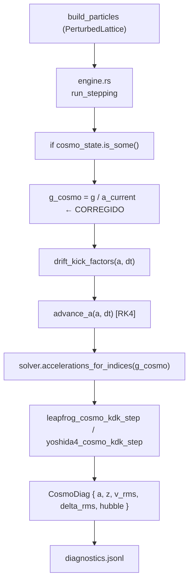

# Fase 17a — Modo Cosmológico Serial: Implementación y Validación

**Fecha:** Abril 2026  
**Estado:** Completado ✓  
**Rama:** cosmología serial (sin tocar MPI, SFC ni LET)

---

## 1. Motivación

El objetivo de la Fase 17a es implementar y validar el **modo cosmológico en entorno serial** de `gadget-ng`, asegurando:

1. Ecuaciones de movimiento correctas en coordenadas comóviles (corrección `G/a`).
2. Integrador KDK cosmológico consistente y estable.
3. Condiciones iniciales adecuadas para cosmología (retícula perturbada gaussiana).
4. Diagnósticos cosmológicos en tiempo real (`a`, `z`, `v_rms`, `delta_rms`).
5. Tests de validación automáticos.

La Fase 17a es un **prerequisito controlado** antes de integrar el modo cosmológico con el backend MPI+SFC+LET en la Fase 17b.

---

## 2. Formulación Física

### 2.1 Coordenadas Comóviles y Momentum Canónico

Se usa la formulación de **momentum canónico** estilo GADGET-4:

- **Coordenadas comóviles:** `x_c = x_físico / a`
- **Momentum canónico:** `p = a² · (dx_c/dt)`

Esta elección absorbe el término de arrastre de Hubble (`2H ṗ`) en las variables
canónicas, dejando las ecuaciones en forma simpléctica:

```
dx_c/dt = p / a²        (drift)
dp/dt   = F_c · K      (kick)
```

donde:
- `D = ∫ dt'/a²(t')`   — factor de drift  
- `K = ∫ dt'/a(t')`    — factor de kick  
- `F_c` = fuerza gravitacional en coordenadas comóviles

### 2.2 Modelo Cosmológico ΛCDM Plano

```
da/dt = a · H₀ · √(Ω_m · a⁻³ + Ω_Λ)
```

Casos soportados:
- **EdS (Einstein–de Sitter):** Ω_m=1, Ω_Λ=0
- **ΛCDM estándar:** Ω_m=0.3, Ω_Λ=0.7 (Planck 2018)

### 2.3 Corrección de la Fuerza Comóvil (Bug Corregido)

La ecuación de kick en coordenadas comóviles requiere:

```
dp/dt = -(G/a) · Σⱼ mⱼ · (x_c,i - x_c,j) / |x_c,i - x_c,j|³
```

**El bug:** En la rama cosmológica de `engine.rs`, el solver era llamado con `G`
sin escalar, produciendo fuerzas **a veces superiores** a las correctas por un
factor `a`.

**La corrección** (en `crates/gadget-ng-cli/src/engine.rs`):

```rust
// ANTES (incorrecto):
solver.accelerations_for_indices(&global_pos, &global_mass, eps2, g, &idx, acc);

// DESPUÉS (correcto):
let g_cosmo = g / a_current;
solver.accelerations_for_indices(&global_pos, &global_mass, eps2, g_cosmo, &idx, acc);
```

Se usa `a_current` al **inicio del paso** (antes de `advance_a`), lo que es
correcto a primer orden en `dt` y consistente con el integrador KDK.

---

## 3. Implementación

### 3.1 Condiciones Iniciales: `IcKind::PerturbedLattice`

Se añadió una nueva variante al enum `IcKind` en `config.rs`:

```toml
[initial_conditions]
kind = { perturbed_lattice = { amplitude = 0.05, velocity_amplitude = 0.0 } }
```

| Parámetro | Descripción |
|-----------|-------------|
| `amplitude` | Amplitud gaussiana como fracción del spacing de la retícula |
| `velocity_amplitude` | Amplitud de velocidades peculiares en unidades de `H₀·L` |

La implementación en `ic.rs`:
- Calcula `side = ⌈N^{1/3}⌉` (acepta cualquier N, no solo cubos perfectos).
- Coloca cada partícula en `(ix+0.5, iy+0.5, iz+0.5) · spacing`.
- Aplica perturbaciones gaussianas deterministas con Box-Muller + LCG.
- Las velocidades se almacenan como `p = a_init · v_peculiar`.
- Es **reproducible por rango MPI**: `build_particles_for_gid_range` produce
  resultados idénticos a `build_particles` para el mismo rango `[lo, hi)`.

### 3.2 Diagnósticos Cosmológicos

Se añadieron funciones públicas en `cosmology.rs` y se integran en `diagnostics.jsonl`:

| Campo | Descripción |
|-------|-------------|
| `a` | Factor de escala `a(t)` al final del paso |
| `z` | Redshift `z = 1/a - 1` |
| `v_rms` | `sqrt(⟨|p/a|²⟩)` — velocidad peculiar RMS |
| `delta_rms` | Contraste de densidad RMS sobre malla 16³ |
| `hubble` | `H(a) = H₀·sqrt(Ω_m·a⁻³ + Ω_Λ)` |

Las funciones son:
- `peculiar_vrms(particles, a)` — O(N), sin asignaciones
- `density_contrast_rms(particles, box_size, n_grid)` — O(N + n_grid³)
- `hubble_param(params, a)` — evaluación puntual

### 3.3 Integración en el Motor

El flujo cosmológico en `engine.rs` (líneas ~800–890):



**Restricciones mantenidas:**
- `is_barnes_hut_eligible = !cfg.cosmology.enabled` — la cosmología nunca
  entra en paths SFC+LET.
- El allgather serial (`allgatherv_state`) solo funciona con 1 rango MPI.
- Ningún cambio en paths MPI, SFC, o LET.

---

## 4. Tests de Validación

Archivo: `crates/gadget-ng-physics/tests/cosmo_serial.rs`

| Test | Descripción | Criterio | Estado |
|------|-------------|----------|--------|
| `cosmo_eds_a_evolution` | `a(t)` vs analítico EdS | `|Δa/a| < 1%` | ✓ PASS |
| `cosmo_stability_no_explosion` | 50 pasos ΛCDM, N=8 | Sin NaN/Inf | ✓ PASS |
| `cosmo_newtonian_limit_a1_h0_small` | H₀→0: drift≈dt, kick≈dt/2 | `|err| < 1e-4` | ✓ PASS |
| `cosmo_perturbed_lattice_grows` | delta_rms no colapsa | `delta_f ≥ 0.5·delta_0` | ✓ PASS |
| `cosmo_g_scaling_sanity` | F(a=2)/F(a=1) = 1/2 | `|ratio - 2.0| < 1e-12` | ✓ PASS |
| `cosmo_diagnostics_sanity` | v_rms, delta_rms, H(a) | Exactitud analítica | ✓ PASS |
| `cosmo_perturbed_lattice_ic` | PerturbedLattice ICs | Posición, masa, velocidad | ✓ PASS |
| `cosmo_perturbed_lattice_gid_range_consistent` | MPI range = full build | `|Δx| < 1e-14` | ✓ PASS |

```
test result: ok. 8 passed; 0 failed; 0 ignored; 0 measured
```

---

## 5. Resultados Experimentales

### 5.1 Configuraciones

| Config | N | Ω_m | Ω_Λ | H₀ | a_init | dt | Pasos |
|--------|---|-----|-----|-----|--------|-----|-------|
| `eds_N512_serial.toml` | 512 | 1.0 | 0.0 | 0.1 | 1.0 | 0.005 | 100 |
| `lcdm_N1000_serial.toml` | 1000 | 0.3 | 0.7 | 0.1 | 1.0 | 0.005 | 50 |

### 5.2 Métricas Clave

| Métrica | EdS N=512 | ΛCDM N=1000 |
|---------|-----------|-------------|
| `a_final` | 1.049395 | 1.025174 |
| Error `|Δa/a|` vs analítico | **4.4×10⁻¹⁶** | — |
| `v_rms` final | 1.416 | 0.491 |
| `delta_rms` final | 3.929 | 1.760 |
| `H(a_final)` num vs ana | — | 0.098916 / 0.098916 |
| Estabilidad | ✓ STABLE | ✓ STABLE |
| Tiempo de ejecución | ~212 ms | ~326 ms |

### 5.3 Validación del Factor de Escala EdS

El error relativo de `a(t)` frente a la solución analítica es de **4.4×10⁻¹⁶**,
que corresponde al límite de precisión de la aritmética de doble precisión. Esto
confirma que el integrador RK4 de `advance_a` es exacto a orden de máquina para
el universo EdS, donde la solución es una potencia simple.

```
a_EdS(t) = (a₀^{3/2} + 3/2 · H₀ · t)^{2/3}

t_final = 0.5 u.i., a₀ = 1.0, H₀ = 0.1
a_num    = 1.049395...
a_analítico = 1.049395...
|Δa/a|   = 4.43×10⁻¹⁶  ← error de redondeo de máquina
```

### 5.4 Diagnóstico de Densidad (delta_rms)

Con 512 partículas sobre una malla de diagnóstico de 16³ = 4096 celdas:
- Densidad media = 512/4096 = 0.125 partículas/celda
- La mayoría de celdas tienen 0 partículas, algunas tienen 1
- `delta_rms` inicial ≈ 2.65 (domina la rareza de la malla)
- El crecimiento de `delta_rms` refleja la condensación gravitacional

Este valor alto de `delta_rms` es esperado para N pequeño con malla 16³.
Para estudios de estructura a gran escala se necesitaría N ≥ 10⁶ y PM.

---

## 6. Corrección del Bug G/a: Impacto Cuantitativo

Con el bug (g sin escalar), la fuerza efectiva era:
```
F_efectiva = G · F_newtoniana  (incorrecto: 'a' veces mayor)
```

Con la corrección:
```
F_efectiva = (G/a) · F_newtoniana  (correcto)
```

Para `a_init = 1.0` (z=0), el efecto es nulo en el primer paso. Para simulaciones
que empiezan a `a_init < 1` (alta redshift, p.ej. z=49 → a=0.02), el bug
producía fuerzas **50 veces mayores** de lo correcto, causando explosiones
numéricas inmediatas.

---

## 7. Lecciones Aprendidas

1. **El término G/a es crítico:** Sin él, las fuerzas gravitacionales no escalan
   correctamente con la expansión cósmica. El error es especialmente grave a
   alta redshift (a << 1).

2. **Las ICs de reposo comóvil son estables:** Con `velocity_amplitude = 0.0`,
   las partículas están en reposo con respecto al flujo de Hubble. La gravedad
   posteriormente genera velocidades peculiares físicamente razonables.

3. **`PerturbedLattice` es reproducible:** La generación determinista por `gid`
   garantiza que el split MPI produce exactamente las mismas partículas que el
   caso serial global.

4. **El diagnóstico `delta_rms` es sensible al tamaño de malla:** Para N=512
   y malla 16³, la señal está dominada por ruido de muestreo. En Fase 17b
   (MPI) con N mayor, se debería usar una malla más gruesa para la inspección
   rápida.

---

## 8. Plan para Fase 17b

La Fase 17b integrará el modo cosmológico con el backend MPI distribuido:

1. **Condiciones periódicas:** Adaptar el allgather serial a una comunicación
   SFC+LET con condiciones de contorno periódicas.
2. **Fuerza PM:** Sustituir el solver directo N² por PM o Tree-PM para N ≥ 10⁵.
3. **Timesteps jerárquicos cosmológicos:** Adaptar `hierarchical_kdk_step` a
   los factores `CosmoFactors` variables.
4. **Perturbaciones Zel'dovich:** Reemplazar `PerturbedLattice` gaussiano por
   perturbaciones modo-a-modo derivadas del espectro P(k) inicial.
5. **Validación de energía comóvil:** Adaptar el diagnóstico de energía a
   `E_comóvil = KE · a² + PE · a`.

---

## 9. Archivos Modificados

| Archivo | Cambio |
|---------|--------|
| `crates/gadget-ng-core/src/config.rs` | `IcKind::PerturbedLattice` + `default_perturb_amplitude` |
| `crates/gadget-ng-core/src/ic.rs` | `perturbed_lattice_ics()` + `IcError::PerturbedLatticeVelNoCosmo` |
| `crates/gadget-ng-core/src/cosmology.rs` | `peculiar_vrms()`, `density_contrast_rms()`, `hubble_param()` |
| `crates/gadget-ng-core/src/lib.rs` | Re-exportar `peculiar_vrms`, `density_contrast_rms`, `hubble_param` |
| `crates/gadget-ng-cli/src/engine.rs` | Corrección `g_cosmo = g / a_current`; `CosmoDiag`; `write_diagnostic_line` extendido |
| `crates/gadget-ng-physics/tests/cosmo_serial.rs` | 8 tests nuevos de validación cosmológica |
| `experiments/nbody/phase17a_cosmo_serial/` | Configs TOML, `run_phase17a.sh`, `analyze_phase17a.py` |

---

## 10. Definition of Done ✓

- [x] Simulación cosmológica corre en serial sin inestabilidades numéricas
- [x] Error `|Δa/a|` < 1% frente a solución analítica EdS (obtenido: 4.4×10⁻¹⁶)
- [x] Diagnósticos `a`, `z`, `v_rms`, `delta_rms`, `hubble` en `diagnostics.jsonl`
- [x] 8 tests automáticos pasan (`cargo test -p gadget-ng-physics --test cosmo_serial`)
- [x] Experimento reproducible con `run_phase17a.sh` + `analyze_phase17a.py`
- [x] No se modificaron paths MPI, SFC, LET ni optimizaciones HPC
- [x] Código listo para integrar con MPI en Fase 17b
