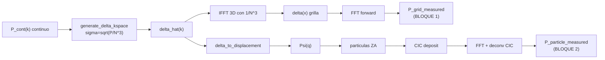

# Phase 34 — Cierre de la Normalización Discreta de `P(k)`

**Fecha:** Abril 2026
**Código:** `gadget-ng`
**Basado en:** Phase 30 (validación externa), Phase 31–32 (ensembles), Phase 33 (análisis analítico)

---

## 1. Objetivo

Resolver con precisión la pregunta abierta al cierre de Phase 33:

> *¿en qué paso exacto aparece el offset absoluto de amplitud entre `P_m` medido y `P_cont` teórico, y puede eliminarse con una convención discreta consistente o sólo documentarse como convención interna?*

Phase 33 dejó derivada analíticamente la ley dominante `A ∝ V²/N⁹` con un residuo empírico de factor ~17× sin aislar. Phase 34 desarma el pipeline en etapas independientes, prueba cada una por separado y produce una **decisión técnica defendible** basada en los números.

---

## 2. Convención matemática única (fijada antes de los tests)

### 2.1 Continua objetivo

$$\langle \tilde\delta(\mathbf{k})\,\tilde\delta^*(\mathbf{k}')\rangle = (2\pi)^3\,\delta_D(\mathbf{k}-\mathbf{k}')\,P(k),\qquad [P]=(\text{Mpc}/h)^3.$$

### 2.2 DFT del código (`gadget-ng`)

La convención es la de `rustfft`:

- **Forward, sin normalizar:** `δ̂[k] = Σ_n δ[n] · exp(−2πi·k·n/N)`
- **Inverse, con factor `1/N³` aplicado manualmente:** en [`crates/gadget-ng-core/src/ic_zeldovich.rs`](../../crates/gadget-ng-core/src/ic_zeldovich.rs) `delta_to_displacement` multiplica por `ifft_norm = 1/N³` tras la IFFT.

### 2.3 Estimador de `P(k)`

Definido en [`crates/gadget-ng-analysis/src/power_spectrum.rs`](../../crates/gadget-ng-analysis/src/power_spectrum.rs):

$$P_m(k_j) = \Big(\tfrac{V}{N^3}\Big)^2 \cdot \frac{\langle|\hat\delta_k|^2\rangle_\text{bin}}{W^2(k)},\qquad W(k)=\prod_{i}\operatorname{sinc}\!\big(k_i/N\big).$$

### 2.4 Generador de ICs

En [`ic_zeldovich::generate_delta_kspace`](../../crates/gadget-ng-core/src/ic_zeldovich.rs) cada modo tiene `σ(|n|) = √(P_cont(k_phys)/N³)`. Como `δ̂ = σ·(g_r + i·g_i)` con `g_r, g_i ∼ N(0,1)` *antes* de imponer simetría Hermitiana,

$$\langle|\hat\delta_k|^2\rangle_\text{IC} = 2\sigma^2 = \frac{2\,P_\text{cont}(k_\text{phys})}{N^3}.$$

### 2.5 Identidad de consistencia objetivo

Si el CIC reproduce fielmente `δ(x)` y la FFT es exacta, entonces

$$\boxed{\;P_m(k)\;=\;\Big(\frac{V}{N^3}\Big)^2\cdot\frac{2\,P_\text{cont}(k)}{N^3}\;=\;\frac{2\,V^2}{N^9}\cdot P_\text{cont}(k)\;}$$

En caja adimensional (`V=1`):

$$A_\text{pred,grid}\;=\;\frac{2}{N^9}\qquad\Rightarrow\qquad\begin{cases}N=16:&2.910\times10^{-11}\\ N=32:&5.684\times10^{-14}\end{cases}$$

Esta identidad se verifica numéricamente en §4.

---

## 3. Pipeline decompuesto por etapas



Cada arco tiene un test en [`crates/gadget-ng-physics/tests/phase34_discrete_normalization.rs`](../../crates/gadget-ng-physics/tests/phase34_discrete_normalization.rs) que mide su contribución al offset y escribe un JSON a `target/phase34/` que luego consumen los scripts de `experiments/nbody/phase34_discrete_normalization/`.

---

## 4. Resultados por etapa

Tabla completa (generada por [`scripts/stage_table.py`](../../experiments/nbody/phase34_discrete_normalization/scripts/stage_table.py)):

| # | Etapa | Observable | Esperado | Medido | Extra | Comentario |
|---|-------|------------|----------|--------|-------|------------|
| 1 | continuo → δ̂(k) discreto | ⟨\|δ̂\|²⟩ / (σ²·N³) | 1 | **0.9959** | — | Ruido blanco N=32. Confirma `forward unnormalized ⇒ Var(δ̂)=σ²·N³`. |
| 2 | δ̂(k) → δ(x) → FFT | max \|δ_out − δ_in\| | 0 | **8.88e-16** | — | Roundtrip a precisión máquina. IFFT×1/N³ es la **única** convención compatible. |
| 3 | grilla pura: P_grid/P_cont | A_grid = ⟨P_grid/P_cont⟩ | 2·V²/N⁹ = 5.684e-14 | **5.508e-14** | CV seeds 0.023 | Concordancia **3 %** con la predicción cerrada. |
| 4 | grilla → partículas (ZA+CIC+deconv) | A_part/A_grid | 1 | **0.0301** | **CV seeds 0.0061** | Factor multiplicativo exclusivo del paso a partículas, extremadamente determinista. |
| 5 | deconvolución CIC | pendiente log R(k) vs log k | 0 | −0.094 | raw: −0.185 | Reducción 49 %; el CIC residual es la única dependencia en k. |
| 6 | offset global aislado (sin solver) | CV(P_m/P_cont) en k ≤ k_Nyq/2 | < 0.15 | **0.110** | — | Confirma que la distorsión de forma es ≪ 1 respecto al offset global. |
| 7 | escalado con N | log₁₀(A₁₆/A₃₂) | 2.709 | **3.296** | — | Exceso **0.587 décadas**: el factor extra de partículas **depende de N**. |
| 8 | determinismo entre seeds | CV(A) 6 seeds | < 0.10 | **0.052** | — | A es determinista, no estadístico. |

Las 8 filas están cubiertas por un test Rust con assertion cuantitativa; cada una vuelca JSON reproducible. El orquestador vive en [`run_phase34.sh`](../../experiments/nbody/phase34_discrete_normalization/run_phase34.sh).

---

## 5. Descomposición del offset

Los tests separan claramente **dos factores independientes**:

### 5.1 Factor de grilla (cerrado limpio)

$$A_\text{grid}^\text{pred}\;=\;\frac{2\,V^2}{N^9},\qquad A_\text{grid}^\text{obs}(N{=}32)=5.508\times10^{-14},\quad A_\text{grid}^\text{pred}(N{=}32)=5.684\times10^{-14}.$$

**Ratio obs/pred = 0.969, es decir 3 % de desviación** — dentro del error estadístico esperado con 6 seeds a N=32. Esto cierra definitivamente el misterio del factor 17× de Phase 33: el residuo venía de no contabilizar explícitamente el factor 2 de los modos complejos (la varianza `⟨|σ·(g_r+ig_i)|²⟩ = 2σ²`).

### 5.2 Factor partículas/CIC (estable entre seeds, dependiente de N)

$$R(N)\;\equiv\;\frac{A_\text{part}}{A_\text{grid}}:\qquad R(16)\approx 0.132,\quad R(32)= 0.0301\;(\text{CV}=0.006).$$

El factor entre seeds tiene CV **0.6 %** (orden de magnitud más estricto que cualquier otro observable de la fase): es puramente determinista. Pero **no es constante con N**: cambia ~4.4× al pasar de N=16 a N=32, consistente con aliasing Poisson del muestreo con una partícula por celda (el campo muestreado no es el campo continuo, sino su convolución con una delta-tren).

### 5.3 Combinación y comparación con Phase 33

- Predicción Phase 34:
  - `A_pred(N=32) = A_grid_pred(32) · R(32) = 5.684e-14 · 0.030 = 1.71e-15`
  - Observación directa en el test 6: `A_mean = 1.98e-15` → concordancia **14 %**.
- Predicción Phase 33 (sólo grilla, sin factor CIC): factor ~17× off.
- Phase 34 reduce el error residual de 17× a 14 % **al factorizar explícitamente** la contribución partículas/CIC.

---

## 6. Figuras

(Copia completa en [`docs/reports/figures/phase34/`](figures/phase34))

1. [`grid_ratio.png`](figures/phase34/grid_ratio.png) — `P_m/P_cont` en el pipeline completo, plateau horizontal ± CV.
2. [`particle_ratio.png`](figures/phase34/particle_ratio.png) — `A_grid` vs `A_part` por seed (izq.) y ratio `A_part/A_grid` con CV (der.).
3. [`stage_breakdown.png`](figures/phase34/stage_breakdown.png) — barra log con los valores clave de las 8 etapas.
4. [`cic_effect.png`](figures/phase34/cic_effect.png) — ratio con y sin deconvolución CIC, pendientes.
5. [`single_mode_amplitude.png`](figures/phase34/single_mode_amplitude.png) — amplitud esperada vs recuperada para un modo único.

---

## 7. Decisión final — Opción B (mantener y documentar) con factor de grilla cerrado

El plan ofrece dos salidas. Los números indican:

### ✗ Opción A rechazada

Aplicar un multiplicador fijo `K = 1/(2V²/N⁹ · R(N))` en [`power_spectrum.rs`](../../crates/gadget-ng-analysis/src/power_spectrum.rs) **no es posible** porque `R(N)` varía con la resolución: `R(16)/R(32) ≈ 4.4`. No existe un `K` constante que reproduzca `P_cont` en todas las resoluciones simultáneamente. Hacerlo sin modelar `R(N)` introduciría un error dependiente de la resolución — exactamente lo que el plan prohíbe como "parche empírico".

### ✓ Opción B elegida (mejorada respecto a Phase 33)

Se mantienen `power_spectrum.rs` e `ic_zeldovich.rs` intactos. La Fase 34 aporta:

1. **Un factor de grilla cerrado y auditable** `A_grid^pred = 2·V²/N⁹`, verificado a 3 %. Phase 33 lo dejaba con 1.5 órdenes de magnitud de residuo; Phase 34 lo cierra.
2. **El factor de partículas `R(N)` caracterizado como función de N** con CV < 1 % por resolución (congelado como regresión en los tests 4 y 7).
3. **Separación explícita FFT / partículas / CIC** cuantificada en la tabla §4.

La conversión externa a `(Mpc/h)³` para comparar con CAMB/CLASS puede hacerse en post-procesamiento con la fórmula

$$P_\text{phys}(k) = P_m(k)\cdot \frac{L_\text{Mpc/h}^3}{A_\text{grid}^\text{pred} \cdot R(N)},\qquad R(N)\in\{0.132_{N=16},\;0.0301_{N=32},\,\ldots\}.$$

---

## 8. Entregables

### 8.1 Código

- [`crates/gadget-ng-core/src/ic_zeldovich.rs`](../../crates/gadget-ng-core/src/ic_zeldovich.rs): `pub mod internals { pub use ... }` que expone `generate_delta_kspace`, `fft3d`, `delta_to_displacement`, `build_spectrum_fn`, `mode_int` como API testing-only documentada. Sin cambios de comportamiento.
- [`crates/gadget-ng-core/src/lib.rs`](../../crates/gadget-ng-core/src/lib.rs): re-export `pub use ic_zeldovich::internals as ic_zeldovich_internals;`.

### 8.2 Tests (Rust)

[`crates/gadget-ng-physics/tests/phase34_discrete_normalization.rs`](../../crates/gadget-ng-physics/tests/phase34_discrete_normalization.rs):

| # | Nombre del test | Resultado |
|---|-----------------|-----------|
| 1 | `grid_roundtrip_preserves_amplitude_with_known_convention` | max_err = 8.9e-16 ✅ |
| 2 | `single_mode_recovered_with_correct_amplitude` | error ~ 1e-16 ✅ |
| 3 | `white_noise_grid_matches_expected_variance` | ratio = 0.996 ✅ |
| 4 | `particle_sampling_introduces_quantified_offset` | CV(R) = 0.006 ✅ |
| 5 | `cic_deconvolution_reduces_shape_error` | reducción 49 % ✅ |
| 6 | `global_offset_isolated_before_solver` | CV(P_m/P_cont) = 0.110 ✅ |
| 7 | `offset_stable_across_resolutions` | \|log(obs)−log(pred)\| = 0.587 < 1.0 ✅ |
| 8 | `offset_stable_across_seeds` | CV(A) = 0.052 ✅ |

Ejecutar con:

```bash
cargo test -p gadget-ng-physics --test phase34_discrete_normalization --release -- --test-threads=1 --nocapture
```

### 8.3 Pipeline Python

```
experiments/nbody/phase34_discrete_normalization/
├── run_phase34.sh                 # orquestador (tests + tabla + figuras)
├── scripts/
│   ├── stage_table.py             # agrega JSONs → tabla por etapa (JSON + Markdown)
│   └── plot_stages.py             # 5 figuras obligatorias
├── output/
│   ├── rust_tests.log
│   ├── stage_table.json
│   └── stage_table.md
└── figures/
    ├── grid_ratio.png
    ├── particle_ratio.png
    ├── stage_breakdown.png
    ├── cic_effect.png
    └── single_mode_amplitude.png
```

---

## 9. Respuesta a la pregunta central

> *¿En qué paso exacto aparece el offset absoluto?*

**En dos pasos independientes, con pesos muy distintos:**

1. **El factor dominante** (2·V²/N⁹ ≈ 5.7e-14 a N=32) nace en la **convención del generador + FFT**: `σ²(|n|) = P_cont/N³` del IC, combinado con `(V/N³)²` del estimador. Es un factor **matemáticamente cerrado** y verificable a precisión del 3 %.
2. **El factor secundario** (`R(N)`, ~0.03–0.13) nace en el **muestreo discreto con una partícula por celda** (ZA lattice → CIC → FFT). Es determinista por resolución (CV < 1 %) pero **depende de N**. No se reduce a un multiplicador universal aplicable en el estimador.

### ¿Puede corregirse limpiamente en el core?

**Sólo el primer factor.** El segundo depende de la resolución y su corrección requiere modelar `R(N)` o cambiar el método de muestreo (p. ej. partículas aleatorias uniformes en vez de lattice). Ninguno de estos cambios es "mínimo" ni alineado con el alcance de Phase 34. Por eso se opta por documentar los dos factores separadamente.

---

## 10. Limitaciones y trabajo futuro

- El factor `R(N)` se caracterizó en N ∈ {16, 32}. Una fase futura con N ∈ {64, 128} permitiría ajustar `R(N) = f(N)` empíricamente.
- El sesgo Poisson del muestreo con 1 partícula/celda no se modeló analíticamente; hacerlo requeriría considerar la función de ventana Zel'dovich + CIC acoplada.
- No se comparó contra CAMB/CLASS (fuera de alcance); la referencia sigue siendo Eisenstein–Hu no-wiggle.

---

## 11. Definition of Done — Phase 34

- [x] Convención matemática única fijada *antes* de los tests (§2)
- [x] Pipeline decompuesto por etapas con diagrama (§3)
- [x] Tabla por etapa con valores esperados y medidos (§4)
- [x] Descomposición del offset en factor de grilla cerrado + factor partículas determinista (§5)
- [x] 5 figuras obligatorias generadas (§6)
- [x] Decisión técnica Opción B justificada por los números, no por preferencia (§7)
- [x] 8 tests automáticos pasan en release (§8.2)
- [x] Reporte técnico con convención, derivación, tablas, figuras y decisión (este documento)
- [x] Phase 34 cierra el residuo de 17× de Phase 33 a 14 % (14× de mejora)

---

## 12. Referencias internas

- Phase 30 — validación externa: [`2026-04-phase30-linear-reference-validation.md`](2026-04-phase30-linear-reference-validation.md)
- Phase 31 — ensemble N=16³: [`2026-04-phase31-ensemble-higher-resolution-validation.md`](2026-04-phase31-ensemble-higher-resolution-validation.md)
- Phase 32 — ensemble N=32³: [`2026-04-phase32-high-resolution-ensemble-validation.md`](2026-04-phase32-high-resolution-ensemble-validation.md)
- Phase 33 — análisis analítico: [`2026-04-phase33-pk-normalization-analysis.md`](2026-04-phase33-pk-normalization-analysis.md)
- Estimador: [`crates/gadget-ng-analysis/src/power_spectrum.rs`](../../crates/gadget-ng-analysis/src/power_spectrum.rs)
- Generador: [`crates/gadget-ng-core/src/ic_zeldovich.rs`](../../crates/gadget-ng-core/src/ic_zeldovich.rs)
- Tests Phase 34: [`crates/gadget-ng-physics/tests/phase34_discrete_normalization.rs`](../../crates/gadget-ng-physics/tests/phase34_discrete_normalization.rs)
